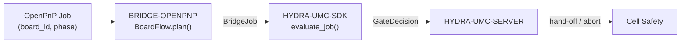

<!-- =============================================================================
HYDRA-UMC-BRIDGE-OPENPNP - OpenPnP board-flow bridge
Copyright (C) 2026 JuanenRac (Electro Hobby 3D) <electrohobby3d@gmail.com>
GPL-3.0-or-later - see LICENSE
============================================================================= -->

<p align="center">
  
</p>

# 🎯 HYDRA-UMC-BRIDGE-OPENPNP

<p align="center">🇺🇸 <b>English</b> | <a href="README_spa.md">🇪🇸 Español</a> | <a href="README_fra.md">🇫🇷 Français</a> | <a href="README_ita.md">🇮🇹 Italiano</a> | <a href="README_deu.md">🇩🇪 Deutsch</a> | <a href="README_zho.md">🇨🇳 简体中文</a> | <a href="README_jpn.md">🇯🇵 日本語</a></p>

### 📋 Traceable Board-Flow Coordination Bridge for OpenPnP

<p align="left">
  
  
  
</p>

---

## 1. 🛠️ TECHNICAL OVERVIEW

**HYDRA-UMC-BRIDGE-OPENPNP** is the high-level board-flow bridge between HYDRA-UMC and OpenPnP. It coordinates PCB preparation, robot loading, native placement, robot unloading and traceable completion. It does not implement placement kinematics, feeder control or raw motion — those stay entirely inside OpenPnP.

It belongs to the **External Automation Bridges** family: a set of sibling repositories (CNC, LASER, OPENPNP, PRINTER3D, ROS2) that all speak the same shared safety contract from `HYDRA-UMC-SDK`, so no bridge can invent its own definition of "safe to work".

### Key Features:
* ✅ **Real traceable board-flow core:** `board_flow.py`'s `BoardFlow.plan()` rejects any job whose `board_id` is empty or has leading/trailing whitespace *before* even evaluating the safety gate — every hand-off is required to carry a stable, clean identifier. *(implemented, tested in `tests/test_board_flow.py`)*
* ✅ **Real per-phase hand-off map:** a fixed dictionary maps every `JobPhase` (`PREPARE`, `LOAD`, `PROCESS`, `UNLOAD`, `COMPLETE`, `ABORT`) to one explicit, human-readable hand-off description — `verify-board-and-fixture`, `robot-loads-board-into-pnp-fixture`, `openpnp-places-declared-job`, and so on. *(implemented)*
* ✅ **Real shared safety gate:** every valid job is evaluated through `evaluate_job()` from `HYDRA-UMC-SDK`'s `bridge_contract`, the same gate every sibling bridge and HYDRA-UMC-SERVER use; a productive hand-off only proceeds when the external machine reports `IDLE` and the HYDRA-UMC cell is `READY`. *(implemented)*
* ✅ **Non-mutating build/test:** `build-test.bat`/`.sh` compile the source and run the board-traceability and fail-safe test suite without touching version files or CHANGELOG. *(implemented, see BUILD & RUN below)*
* ✅ **Read-only OpenPnP profile inspection:** `inspect_openpnp_config.py` parses a saved `machine.xml`, while `openpnp-scripts/HYDRA-UMC/inspect_profile.js` is a manually invoked OpenPnP menu-script template; both report only class and component counts, and the template presents that result in an informational dialog without sending a machine command. *(implemented, tested)*
* ✅ **Trace-only hand-off simulation:** `BoardIdentity` binds board, recipe, revision and lot identifiers before `simulate_board_handoff()` applies the shared SDK gate; it emits a deterministic SHA-256 trace fingerprint only for an allowed plan and has no OpenPnP, serial or machine I/O. *(implemented, tested)*
* ✅ **Trace-only productive-cycle simulation:** `simulate_board_cycle()` evaluates the ordered `PREPARE → LOAD → PROCESS → UNLOAD → COMPLETE` sequence under one explicit cell/machine state; every productive step fails closed outside `READY/IDLE`, and `ABORT` remains separate in the SDK safety path. *(implemented, tested)*
* ✅ **Deterministic evidence contract:** `docs/HANDOFF_EVIDENCE.md` defines schema `1.0` emitted by both simulators. It carries only phase, decision, reason and a permitted identity fingerprint; raw board, recipe, revision and lot values never enter the JSON record. *(implemented, tested)*

---

## 2. 🔄 BOARD-FLOW COORDINATION FLOW



---

## 3. 🧱 ARCHITECTURE & DESIGN DECISIONS

* **Why `board_id` validation happens before anything else in `plan()`.** `BoardFlow.plan()`'s very first check is `not board_id or board_id.strip() != board_id` — a malformed or ambiguous board identifier is rejected immediately, with an explicit reason, instead of being forwarded downstream where it would be harder to trace.
* **Why hand-offs are a fixed dictionary keyed by `JobPhase`, not string formatting.** `BoardFlow._handoffs` maps each of the six supported phases to one literal, unambiguous description. An unknown future phase is rejected with `unrecognized-phase`; it cannot become an allowed hand-off merely because the common SDK gate is otherwise ready.
* **Why the bridge only plans a productive transfer when the external machine is `IDLE` and the cell is `READY`.** Board hand-off is a two-sided physical operation; if either side is not in a known-safe state, planning a transfer would be asking a robot to move into an unpredictable machine.
* **Why `ABORT` can still be requested during a fault.** `JobPhase.ABORT` maps to `request-controlled-stop`, which the shared `evaluate_job()` gate does not block the same way it blocks productive phases — an operator or supervisor must always be able to ask for a controlled stop, even mid-fault.
* **Why the live OpenPnP extension/API is still deferred.** The saved machine profile can now be inspected read-only, but choosing a plugin interface or live surface still requires a non-production test session; that prevents this bridge from embedding unverified motion or feeder assumptions.
* **How this fits the rest of the ecosystem.** BRIDGE-OPENPNP sits between an OpenPnP job and `HYDRA-UMC-SDK` → `HYDRA-UMC-SERVER` → cell safety — it coordinates the robot side of a board hand-off, it never claims placement kinematics or feeder control that belong to OpenPnP itself.

---

## 📂 DIRECTORY STRUCTURE

```text
HYDRA-UMC-BRIDGE-OPENPNP/
├── src/
│   └── hydra_umc_bridge_openpnp/
│       ├── __init__.py
│       └── board_flow.py        # BoardFlow: board_id validation + per-phase hand-off gate
├── tests/
│   └── test_board_flow.py       # Board traceability and fail-safe tests
├── tools/
│   ├── build_test.py            # Non-mutating compile + test runner (build-test.bat/.sh)
│   └── bump_version.py          # Synchronizes pyproject.toml, manifest and CHANGELOG.md
├── build-test.bat / build-test.sh  # Validate only, never modifies the repository
├── build.bat / build.sh            # Validate, then bump version + CHANGELOG on success
├── pyproject.toml               # Package metadata; depends on HYDRA-UMC-SDK (git)
├── hydra-umc.project.json       # Ecosystem manifest (version, maturity, family)
├── CHANGELOG.md
├── CODE_OF_CONDUCT.md / CONTRIBUTING.md / SECURITY.md / SUPPORT.md
├── LICENSE / LICENSE.md
└── README.md / README_*.md      # This file and its 6 translations
```

---

## 4. ⚙️ BUILD & RUN

Requires Python 3.11+. `tools/build_test.py` expects `HYDRA-UMC-SDK` checked out as a sibling directory (`../HYDRA-UMC-SDK`) or pointed at via the `HYDRA_UMC_SDK_ROOT` environment variable.

```bash
# Windows
build-test.bat      # validate only — no version/CHANGELOG change
build.bat            # validate, then bump version + CHANGELOG on success

# Linux/macOS
bash build-test.sh
bash build.sh
```

`build-test` compiles every module under `src/` with `py_compile` and runs the full `unittest` suite (`tests/test_board_flow.py`), proving board-traceability rejection and fail-safe gating — it never modifies the repository. `build` runs that same validation first and, only on success, calls `tools/bump_version.py` to synchronize the version across `pyproject.toml`, `hydra-umc.project.json` and `CHANGELOG.md`. There is no live machine `run` command yet — that requires a validated OpenPnP integration.

---

## ✅ Current Status & Next Steps

**Real today:** version `0.1.0`, a locally tested traceable PCB hand-off core (`BoardFlow`) backed by `HYDRA-UMC-SDK`'s shared job gate, a deterministic seventeen-test `unittest` suite, a saved-profile inspector reporting real OpenPnP actuator/signaler/nozzle-tip evidence alongside head/camera/driver/feeder counts, a visible read-only OpenPnP menu-script template, identity-bound hand-off/cycle simulations, and a CI-verified non-sensitive JSON evidence contract with no machine I/O.

**Integration boundary:** OpenPnP retains placement kinematics, feeder control and raw motion at all times; this bridge only ever gates and traces the *hand-off* around it — robot loading, native placement completion, robot unloading.

**Still ahead:** no live machine connection is claimed — the concrete OpenPnP extension/API will be selected only in an isolated non-production session with an operator present.

---

## 🔗 Related Projects

This project is part of a larger robotics ecosystem by the same author (JuanenRac / Electro Hobby 3D), spanning firmware, control software, AI nodes and fleet tooling. Worth knowing about, since a request might actually be about one of these rather than this repository.

### Directly Related

- **[HYDRA-UMC-SDK](https://github.com/JuanenRac/HYDRA-UMC-SDK)** — the shared jobs-and-safety-gate every bridge (including this one) evaluates jobs through.
- **[HYDRA-UMC-SERVER](https://github.com/JuanenRac/HYDRA-UMC-SERVER)** — the authorised orchestration boundary this bridge reports to.
- **[HYDRA-UMC-SAFETY-ZONES](https://github.com/JuanenRac/HYDRA-UMC-SAFETY-ZONES)** — future cell-zone evidence.

### Rest of the Ecosystem

**HYDRA-UMC platform** — the multi-robot micro-factory cell this bridge coordinates auxiliaries for
- **[HYDRA-UMC](https://github.com/JuanenRac/HYDRA-UMC)** — the CM5 + STM32H745 motherboard orchestrating up to 8 robot arms.
- **[HYDRA-UMC-SERVER](https://github.com/JuanenRac/HYDRA-UMC-SERVER)** — the Express/WebSocket backend every control client and bridge talks to.
- **[HYDRA-UMC-STUDIO](https://github.com/JuanenRac/HYDRA-UMC-STUDIO)** — web-based control dashboard, multi-robot 3D visualization.

**External Automation Bridges** — sibling repos sharing this same `HYDRA-UMC-SDK` job gate
- **[HYDRA-UMC-BRIDGE-CNC](https://github.com/JuanenRac/HYDRA-UMC-BRIDGE-CNC)** — CNC cell coordination bridge.
- **[HYDRA-UMC-BRIDGE-LASER](https://github.com/JuanenRac/HYDRA-UMC-BRIDGE-LASER)** — laser-cell coordination bridge.
- **[HYDRA-UMC-BRIDGE-PRINTER3D](https://github.com/JuanenRac/HYDRA-UMC-BRIDGE-PRINTER3D)** — coordination bridge for open 3D-printing software.
- **[HYDRA-UMC-BRIDGE-ROS2](https://github.com/JuanenRac/HYDRA-UMC-BRIDGE-ROS2)** — bidirectional coordination boundary with ROS 2.

**Safety & Integration Evidence**
- **[HYDRA-UMC-SAFETY-ZONES](https://github.com/JuanenRac/HYDRA-UMC-SAFETY-ZONES)** — cell-zone safety evidence used across the bridge family.
- **[HYDRA-UMC-HIL-BRIDGE](https://github.com/JuanenRac/HYDRA-UMC-HIL-BRIDGE)** — hardware-in-the-loop test evidence.

## 👤 AUTHOR
**JuanenRac** (Electro Hobby 3D)
📧 electrohobby3d@gmail.com

## 📜 LICENSE
GPL-3.0 - See LICENSE for details.
