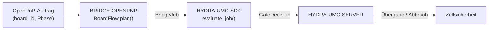

<!-- =============================================================================
HYDRA-UMC-BRIDGE-OPENPNP - OpenPnP-Board-Flow-Brücke
Copyright (C) 2026 JuanenRac (Electro Hobby 3D) <electrohobby3d@gmail.com>
GPL-3.0-or-later - see LICENSE
============================================================================= -->

<p align="center">
  
</p>

# 🎯 HYDRA-UMC-BRIDGE-OPENPNP

<p align="center"><a href="README.md">🇺🇸 English</a> | <a href="README_spa.md">🇪🇸 Español</a> | <a href="README_fra.md">🇫🇷 Français</a> | <a href="README_ita.md">🇮🇹 Italiano</a> | 🇩🇪 <b>Deutsch</b> | <a href="README_zho.md">🇨🇳 简体中文</a> | <a href="README_jpn.md">🇯🇵 日本語</a></p>

### 📋 Nachvollziehbare Board-Flow-Koordinationsbrücke für OpenPnP

<p align="left">
  
  
  
</p>

---

## 1. 🛠️ TECHNISCHER ÜBERBLICK

**HYDRA-UMC-BRIDGE-OPENPNP** ist die High-Level-Board-Flow-Brücke zwischen HYDRA-UMC und OpenPnP. Sie koordiniert PCB-Vorbereitung, Roboterbeladung, native Bestückung, Roboterentladung und nachvollziehbaren Abschluss. Sie implementiert weder Bestückungskinematik, Feeder-Steuerung noch rohe Bewegung — das bleibt vollständig innerhalb von OpenPnP.

Sie gehört zur Familie **External Automation Bridges**: einer Gruppe von Schwester-Repositories (CNC, LASER, OPENPNP, PRINTER3D, ROS2), die alle denselben gemeinsamen Sicherheitsvertrag von `HYDRA-UMC-SDK` sprechen, sodass keine Brücke ihre eigene Definition von "sicher zum Arbeiten" erfinden kann.

### Kernfunktionen:
* ✅ **Echter nachvollziehbarer Board-Flow-Kern:** `board_flow.py` — `BoardFlow.plan()` lehnt jeden Auftrag ab, dessen `board_id` leer ist oder führende/nachgestellte Leerzeichen enthält, *noch bevor* überhaupt das Sicherheitsgatter bewertet wird — jede Übergabe muss eine stabile, saubere Kennung tragen. *(implementiert, getestet in `tests/test_board_flow.py`)*
* ✅ **Echte Übergabe-Zuordnung pro Phase:** ein festes Dictionary ordnet jeder `JobPhase` (`PREPARE`, `LOAD`, `PROCESS`, `UNLOAD`, `COMPLETE`, `ABORT`) eine explizite, lesbare Übergabebeschreibung zu — `verify-board-and-fixture`, `robot-loads-board-into-pnp-fixture`, `openpnp-places-declared-job` usw. *(implementiert)*
* ✅ **Echtes gemeinsames Sicherheitsgatter:** jeder gültige Auftrag wird über `evaluate_job()` aus dem `bridge_contract` von `HYDRA-UMC-SDK` bewertet — demselben Gatter, das jede Schwesterbrücke und HYDRA-UMC-SERVER verwenden; eine produktive Übergabe erfolgt nur, wenn die externe Maschine `IDLE` meldet und die HYDRA-UMC-Zelle `READY` ist. *(implementiert)*
* ✅ **Nicht-mutierender Build/Test:** `build-test.bat`/`.sh` kompilieren den Quellcode und führen die Test-Suite für Board-Rückverfolgbarkeit und Ausfallsicherheit aus, ohne Versionsdateien oder das CHANGELOG anzufassen. *(implementiert, siehe BUILD & AUSFÜHRUNG unten)*
* ✅ **Schreibgeschützte OpenPnP-Profilprüfung:** `inspect_openpnp_config.py` analysiert eine gespeicherte `machine.xml`, während `openpnp-scripts/HYDRA-UMC/inspect_profile.js` eine manuell aufgerufene Vorlage für ein OpenPnP-Menüskript ist; beide melden nur Klasse und Komponentenanzahlen, und die Vorlage zeigt dieses Ergebnis in einem Informationsdialog ohne Maschinenbefehl. *(implementiert, getestet)*
* ✅ **Nur nachvollziehbare Übergabesimulation:** `BoardIdentity` bindet Kennungen für Platine, Rezept, Revision und Los, bevor `simulate_board_handoff()` das gemeinsame SDK-Gatter anwendet; sie erzeugt nur für einen erlaubten Plan einen deterministischen SHA-256-Fingerabdruck und hat keine OpenPnP-, serielle oder Maschinen-E/A. *(implementiert, getestet)*

---

## 2. 🔄 BOARD-FLOW-KOORDINATIONSABLAUF



---

## 3. 🧱 ARCHITEKTUR UND DESIGN-ENTSCHEIDUNGEN

* **Warum die `board_id`-Validierung vor allem anderen in `plan()` erfolgt.** Die allererste Prüfung in `BoardFlow.plan()` ist `not board_id or board_id.strip() != board_id` — eine fehlerhafte oder mehrdeutige Board-Kennung wird sofort mit einer expliziten Begründung abgelehnt, statt stromabwärts weitergereicht zu werden, wo sie schwerer nachzuverfolgen wäre.
* **Warum Übergaben ein festes, nach `JobPhase` indiziertes Dictionary sind und keine String-Formatierung.** `BoardFlow._handoffs` ordnet jede der sechs unterstützten Phasen einer wörtlichen, eindeutigen Beschreibung zu. Eine unbekannte zukünftige Phase wird als `unrecognized-phase` abgelehnt; sie kann nicht allein wegen eines bereiten gemeinsamen SDK-Gatters zu einer erlaubten Übergabe werden.
* **Warum die Brücke einen produktiven Transfer nur plant, wenn die externe Maschine `IDLE` und die Zelle `READY` ist.** Board-Übergabe ist eine zweiseitige physische Operation; ist eine der beiden Seiten nicht in einem bekannt sicheren Zustand, würde die Planung eines Transfers bedeuten, einen Roboter in eine unvorhersehbare Maschine hinein zu bewegen.
* **Warum `ABORT` auch während eines Fehlers angefordert werden kann.** `JobPhase.ABORT` wird auf `request-controlled-stop` abgebildet, das das gemeinsame `evaluate_job()`-Gatter nicht so blockiert wie produktive Phasen — ein Bediener oder Aufseher muss immer einen kontrollierten Stopp anfordern können, selbst mitten in einem Fehlerzustand.
* **Warum die Live-OpenPnP-Erweiterung/-API weiter zurückgestellt wird.** Das gespeicherte Maschinenprofil kann nun schreibgeschützt geprüft werden, doch die Wahl einer Plugin-Schnittstelle oder Live-Oberfläche erfordert weiterhin eine nicht-produktive Testsitzung; so werden unbestätigte Bewegungs- oder Feeder-Annahmen vermieden.
* **Wie das in den Rest des Ökosystems passt.** BRIDGE-OPENPNP sitzt zwischen einem OpenPnP-Auftrag und `HYDRA-UMC-SDK` → `HYDRA-UMC-SERVER` → Zellsicherheit: es koordiniert die Roboterseite einer Board-Übergabe, es beansprucht niemals die Bestückungskinematik oder Feeder-Steuerung, die zu OpenPnP selbst gehören.

---

## 📂 VERZEICHNISSTRUKTUR

```text
HYDRA-UMC-BRIDGE-OPENPNP/
├── src/
│   └── hydra_umc_bridge_openpnp/
│       ├── __init__.py
│       └── board_flow.py        # BoardFlow: board_id-Validierung + Übergabe-Gatter pro Phase
├── tests/
│   └── test_board_flow.py       # Board-Rückverfolgbarkeits- und Ausfallsicherheitstests
├── tools/
│   ├── build_test.py            # Nicht-mutierender Compiler + Testläufer (build-test.bat/.sh)
│   └── bump_version.py          # Synchronisiert pyproject.toml, Manifest und CHANGELOG.md
├── build-test.bat / build-test.sh  # Validiert nur, ändert das Repository nie
├── build.bat / build.sh            # Validiert und erhöht bei Erfolg Version + CHANGELOG
├── pyproject.toml               # Paket-Metadaten; hängt von HYDRA-UMC-SDK ab (git)
├── hydra-umc.project.json       # Ökosystem-Manifest (Version, Reifegrad, Familie)
├── CHANGELOG.md
├── CODE_OF_CONDUCT.md / CONTRIBUTING.md / SECURITY.md / SUPPORT.md
├── LICENSE / LICENSE.md
└── README.md / README_*.md      # Diese Datei und ihre 6 Übersetzungen
```

---

## 4. ⚙️ BUILD & AUSFÜHRUNG

Erfordert Python 3.11+. `tools/build_test.py` erwartet, dass `HYDRA-UMC-SDK` als Schwesterverzeichnis (`../HYDRA-UMC-SDK`) ausgecheckt oder über die Umgebungsvariable `HYDRA_UMC_SDK_ROOT` angegeben ist.

```bash
# Windows
build-test.bat      # nur Validierung — keine Versions-/CHANGELOG-Änderung
build.bat            # validiert und erhöht bei Erfolg Version + CHANGELOG

# Linux/macOS
bash build-test.sh
bash build.sh
```

`build-test` kompiliert jedes Modul unter `src/` mit `py_compile` und führt die vollständige `unittest`-Suite aus (`tests/test_board_flow.py`), was die Ablehnung wegen Board-Rückverfolgbarkeit und das Ausfallsicherheitsgatter belegt — es ändert das Repository nie. `build` führt zuerst dieselbe Validierung aus und ruft nur bei Erfolg `tools/bump_version.py` auf, um die Version in `pyproject.toml`, `hydra-umc.project.json` und `CHANGELOG.md` zu synchronisieren. Es gibt noch keinen echten Maschinen-`run`-Befehl — dafür ist eine validierte OpenPnP-Integration erforderlich.

---

## ✅ AKTUELLER STATUS UND NÄCHSTE SCHRITTE

**Heute real:** Version `0.0.6`, ein lokal getesteter nachvollziehbarer PCB-Übergabekern (`BoardFlow`), gestützt auf das gemeinsame Auftragsgatter von `HYDRA-UMC-SDK`, eine deterministische `unittest`-Suite mit zehn Tests, ein Prüfer für ein gespeichertes Profil, eine sichtbare schreibgeschützte OpenPnP-Menüvorlage sowie eine identitätsgebundene Simulation ohne Maschinen-E/A.

**Integrationsgrenze:** OpenPnP behält jederzeit Bestückungskinematik, Feeder-Steuerung und rohe Bewegung; diese Brücke steuert und verfolgt ausschließlich die *Übergabe* darum herum — Roboterbeladung, Abschluss der nativen Bestückung, Roboterentladung.

**Noch offen:** es wird keine Live-Verbindung zu einer OpenPnP-Maschine behauptet — die konkrete Erweiterung/API wird nur in einer isolierten, nicht-produktiven Sitzung mit anwesendem Bediener gewählt.

---

## 🔗 VERWANDTE PROJEKTE

Dieses Projekt ist Teil eines größeren Robotik-Ökosystems desselben Autors (JuanenRac / Electro Hobby 3D), das Firmware, Steuerungssoftware, KI-Knoten und Flotten-Tooling umfasst. Es lohnt sich, das zu wissen, da eine Anfrage tatsächlich eines dieser Projekte betreffen könnte statt dieses Repositorys.

### Direkt verwandt

- **[HYDRA-UMC-SDK](https://github.com/JuanenRac/HYDRA-UMC-SDK)** — das gemeinsame Auftrags- und Sicherheitsgatter, über das diese Brücke (und alle anderen) ihre Aufträge bewertet.
- **[HYDRA-UMC-SERVER](https://github.com/JuanenRac/HYDRA-UMC-SERVER)** — die autorisierte Orchestrierungsgrenze, an die diese Brücke berichtet.
- **[HYDRA-UMC-SAFETY-ZONES](https://github.com/JuanenRac/HYDRA-UMC-SAFETY-ZONES)** — künftiger Nachweis der Zellzone.

### Rest des Ökosystems

**HYDRA-UMC-Plattform** — die Multi-Roboter-Mikrofabrik, für die diese Brücke Hilfsfunktionen koordiniert
- **[HYDRA-UMC](https://github.com/JuanenRac/HYDRA-UMC)** — die CM5- + STM32H745-Hauptplatine, die bis zu 8 Roboterarme orchestriert.
- **[HYDRA-UMC-SERVER](https://github.com/JuanenRac/HYDRA-UMC-SERVER)** — das Express/WebSocket-Backend, mit dem jeder Steuerungsclient und jede Brücke spricht.
- **[HYDRA-UMC-STUDIO](https://github.com/JuanenRac/HYDRA-UMC-STUDIO)** — webbasiertes Steuerungs-Dashboard, Multi-Roboter-3D-Visualisierung.

**External Automation Bridges** — Schwester-Repositories, die dasselbe `HYDRA-UMC-SDK`-Auftragsgatter teilen
- **[HYDRA-UMC-BRIDGE-CNC](https://github.com/JuanenRac/HYDRA-UMC-BRIDGE-CNC)** — CNC-Zellkoordinationsbrücke.
- **[HYDRA-UMC-BRIDGE-LASER](https://github.com/JuanenRac/HYDRA-UMC-BRIDGE-LASER)** — Koordinationsbrücke für Laserzellen.
- **[HYDRA-UMC-BRIDGE-PRINTER3D](https://github.com/JuanenRac/HYDRA-UMC-BRIDGE-PRINTER3D)** — Koordinationsbrücke für offene 3D-Drucksoftware.
- **[HYDRA-UMC-BRIDGE-ROS2](https://github.com/JuanenRac/HYDRA-UMC-BRIDGE-ROS2)** — bidirektionale Koordinationsgrenze zu ROS 2.

**Sicherheits- und Integrationsnachweise**
- **[HYDRA-UMC-SAFETY-ZONES](https://github.com/JuanenRac/HYDRA-UMC-SAFETY-ZONES)** — Sicherheitsnachweise für Zellzonen, die in der gesamten Brückenfamilie verwendet werden.
- **[HYDRA-UMC-HIL-BRIDGE](https://github.com/JuanenRac/HYDRA-UMC-HIL-BRIDGE)** — Hardware-in-the-Loop-Testnachweise.

## 👤 AUTOR
**JuanenRac** (Electro Hobby 3D)
📧 electrohobby3d@gmail.com

## 📜 LIZENZ
GPL-3.0 - Siehe LICENSE für Details.

## 🛠️ BUILD & AUSFÜHRUNG

Verwenden Sie die versionslose Build-Prüfung vor einem Release-Build:

| Aktion | Windows | Linux / macOS |
|---|---|---|
| Build-Prüfung (keine Versions- oder CHANGELOG-Änderung) | `build-test.bat` | `./build-test.sh` |
| Ausführung / Entwicklung (falls vorhanden) | `run*.bat` oder `dev*.bat` | `./run*.sh` oder `./dev*.sh` |

`build-test.bat` und `build-test.sh` kompilieren oder validieren den Projekt-Stack, ohne `hydra-umc.project.json` zu erhöhen oder `CHANGELOG.md` zu ändern. Sie dürfen nur normale Compiler-Ausgaben erzeugen. Bestehende `build*.bat`-, `build*.sh`-, `run*`- und `dev*`-Skripte behalten ihr projektspezifisches, versioniertes oder Laufzeitverhalten; verwenden Sie sie, wenn dieses Verhalten benötigt wird.
