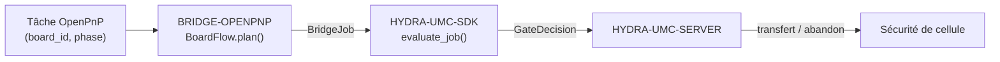

<!-- =============================================================================
HYDRA-UMC-BRIDGE-OPENPNP - Pont de flux de cartes pour OpenPnP
Copyright (C) 2026 JuanenRac (Electro Hobby 3D) <electrohobby3d@gmail.com>
GPL-3.0-or-later - see LICENSE
============================================================================= -->

<p align="center">
  
</p>

# 🎯 HYDRA-UMC-BRIDGE-OPENPNP

<p align="center"><a href="README.md">🇺🇸 English</a> | <a href="README_spa.md">🇪🇸 Español</a> | 🇫🇷 <b>Français</b> | <a href="README_ita.md">🇮🇹 Italiano</a> | <a href="README_deu.md">🇩🇪 Deutsch</a> | <a href="README_zho.md">🇨🇳 简体中文</a> | <a href="README_jpn.md">🇯🇵 日本語</a></p>

### 📋 Pont de coordination de flux de cartes traçable pour OpenPnP

<p align="left">
  
  
  
</p>

---

## 1. 🛠️ APERÇU TECHNIQUE

**HYDRA-UMC-BRIDGE-OPENPNP** est le pont haut niveau de flux de cartes entre HYDRA-UMC et OpenPnP. Il coordonne la préparation des PCB, le chargement par robot, le placement natif, le déchargement par robot et l'achèvement traçable. Il n'implémente ni la cinématique de placement, ni le contrôle des chargeurs, ni le mouvement brut — tout cela reste entièrement à l'intérieur d'OpenPnP.

Il appartient à la famille **External Automation Bridges** : un ensemble de dépôts frères (CNC, LASER, OPENPNP, PRINTER3D, ROS2) qui partagent le même contrat de sécurité de `HYDRA-UMC-SDK`, afin qu'aucun pont ne puisse inventer sa propre définition du « sûr pour travailler ».

### Fonctionnalités clés :
* ✅ **Noyau de flux de cartes traçable, réel :** `board_flow.py` — `BoardFlow.plan()` rejette toute tâche dont le `board_id` est vide ou comporte des espaces en début/fin *avant même* d'évaluer le portail de sécurité ; chaque transfert doit porter un identifiant stable et propre. *(implémenté, testé dans `tests/test_board_flow.py`)*
* ✅ **Carte de transfert par phase, réelle :** un dictionnaire fixe associe chaque `JobPhase` (`PREPARE`, `LOAD`, `PROCESS`, `UNLOAD`, `COMPLETE`, `ABORT`) à une description explicite et lisible du transfert — `verify-board-and-fixture`, `robot-loads-board-into-pnp-fixture`, `openpnp-places-declared-job`, etc. *(implémenté)*
* ✅ **Portail de sécurité partagé, réel :** chaque tâche valide est évaluée via `evaluate_job()` du `bridge_contract` de `HYDRA-UMC-SDK`, le même portail utilisé par tous les ponts frères et HYDRA-UMC-SERVER ; un transfert productif n'avance que lorsque la machine externe rapporte `IDLE` et que la cellule HYDRA-UMC est `READY`. *(implémenté)*
* ✅ **Build/test non mutant :** `build-test.bat`/`.sh` compilent le code source et exécutent la suite de tests de traçabilité des cartes et de sécurité intrinsèque sans toucher aux fichiers de version ni au CHANGELOG. *(implémenté, voir COMPILATION & EXÉCUTION ci-dessous)*
* ✅ **Inspection en lecture seule du profil OpenPnP :** `inspect_openpnp_config.py` analyse un `machine.xml` enregistré, tandis que `openpnp-scripts/HYDRA-UMC/inspect_profile.js` est un modèle de script de menu OpenPnP invoqué manuellement ; les deux ne rapportent que la classe et le nombre de composants, et le modèle affiche ce résultat dans une boîte d'information sans envoyer de commande machine. *(implémenté, testé)*
* ✅ **Simulation de transfert uniquement traçable :** `BoardIdentity` lie les identifiants de carte, recette, révision et lot avant que `simulate_board_handoff()` applique le portail partagé du SDK ; il n'émet une empreinte SHA-256 déterministe que pour un plan autorisé et n'a aucune E/S OpenPnP, série ou machine. *(implémenté, testé)*
* ✅ **Simulation du cycle productif uniquement traçable :** `simulate_board_cycle()` évalue la séquence ordonnée `PREPARE → LOAD → PROCESS → UNLOAD → COMPLETE` sous un état explicite de cellule/machine ; chaque étape productive échoue fermée hors de `READY/IDLE`, et `ABORT` reste séparé dans le chemin de sécurité du SDK. *(implémenté, testé)*
* ✅ **Contrat d'évidence déterministe :** `docs/HANDOFF_EVIDENCE.md` définit le schéma `1.0` émis par les deux simulateurs. Il ne transporte que phase, décision, motif et une empreinte d'identité autorisée ; les valeurs brutes de carte, recette, révision et lot n'entrent jamais dans l'enregistrement JSON. *(implémenté, testé)*

---

## 2. 🔄 FLUX DE COORDINATION DE CARTES



---

## 3. 🧱 ARCHITECTURE ET CHOIX DE CONCEPTION

* **Pourquoi la validation du `board_id` a lieu avant toute autre chose dans `plan()`.** La toute première vérification de `BoardFlow.plan()` est `not board_id or board_id.strip() != board_id` — un identifiant de carte malformé ou ambigu est rejeté immédiatement, avec une raison explicite, plutôt que transmis en aval où il serait plus difficile à tracer.
* **Pourquoi les transferts sont un dictionnaire fixe indexé par `JobPhase`, et non un formatage de chaîne.** `BoardFlow._handoffs` associe chacune des six phases prises en charge à une description littérale et non ambiguë. Une future phase inconnue est rejetée comme `unrecognized-phase` ; elle ne peut pas devenir un transfert autorisé simplement parce que le portail commun du SDK est prêt.
* **Pourquoi le pont ne planifie un transfert productif que lorsque la machine externe est `IDLE` et la cellule `READY`.** Le transfert de carte est une opération physique à deux acteurs ; si l'un des deux côtés n'est pas dans un état connu et sûr, planifier un transfert reviendrait à demander à un robot de se déplacer vers une machine imprévisible.
* **Pourquoi `ABORT` peut toujours être demandé pendant un défaut.** `JobPhase.ABORT` est associé à `request-controlled-stop`, que le portail partagé `evaluate_job()` ne bloque pas de la même manière que les phases productives — un opérateur ou un superviseur doit toujours pouvoir demander un arrêt contrôlé, même en plein défaut.
* **Pourquoi l'extension/API OpenPnP en direct reste reportée.** Le profil machine enregistré peut désormais être inspecté en lecture seule, mais choisir une interface de plugin ou une surface en direct exige toujours une session d'essai non productive ; cela évite d'intégrer des hypothèses de mouvement ou de chargeur non vérifiées.
* **Comment cela s'intègre dans le reste de l'écosystème.** BRIDGE-OPENPNP se situe entre une tâche OpenPnP et `HYDRA-UMC-SDK` → `HYDRA-UMC-SERVER` → sécurité de cellule : il coordonne le côté robotique d'un transfert de carte, il ne revendique jamais la cinématique de placement ni le contrôle des chargeurs qui appartiennent à OpenPnP lui-même.

---

## 📂 STRUCTURE DES RÉPERTOIRES

```text
HYDRA-UMC-BRIDGE-OPENPNP/
├── src/
│   └── hydra_umc_bridge_openpnp/
│       ├── __init__.py
│       ├── board_flow.py        # BoardFlow : validation board_id + portail de transfert par phase
│       ├── configuration.py     # Inspecte un XML machine OpenPnP sans ouvrir ni modifier aucune machine
│       ├── evidence.py          # Preuve déterministe et non sensible issue de simulations purement locales
│       ├── handoff.py           # Valide/simule un transfert PCB traçable - n'importe jamais OpenPnP, ne touche aucune E/S
│       └── mqtt_transport.py    # Transport MQTT réel - aucun transport machine réel n'existe ici
├── tests/
│   ├── test_board_flow.py       # Tests de traçabilité des cartes et de sécurité
│   └── test_mqtt_transport.py   # Tests de forme preuve/statut MQTT contre un client broker simulé
├── tools/
│   ├── build_test.py            # Compilateur + lanceur de tests non mutant (build-test.bat/.sh)
│   ├── bump_version.py          # Synchronise pyproject.toml, manifeste et CHANGELOG.md
│   ├── ci_validate.py           # Base CI sans dépendances et non destructive (utilisée par .github/workflows/ci.yml)
│   ├── inspect_openpnp_config.py # Inspecteur CLI en lecture seule pour un machine.xml OpenPnP enregistré
│   ├── simulate_cycle.py        # CLI du simulateur de cycle productif, traçabilité uniquement
│   └── simulate_handoff.py      # CLI du simulateur de passation de carte, traçabilité uniquement
├── docs/
│   ├── BRIDGE_GUIDE.md          # Portée, plateformes compatibles, scripts, portail d'acceptation matérielle
│   └── HANDOFF_EVIDENCE.md      # Ce qui compte comme preuve de transfert réelle et ce que ce bridge refuse de déduire
├── images/
│   └── HYDRA_UMC_BANNER.svg     # Bannière du README
├── build-test.bat / build-test.sh  # Valide uniquement, ne modifie jamais le dépôt
├── build.bat / build.sh            # Valide puis, si succès, incrémente version + CHANGELOG
├── pyproject.toml               # Métadonnées du paquet ; dépend de HYDRA-UMC-SDK (git)
├── hydra-umc.project.json       # Manifeste de l'écosystème (version, maturité, famille)
├── CHANGELOG.md
├── CODE_OF_CONDUCT.md / CONTRIBUTING.md / SECURITY.md / SUPPORT.md
├── LICENSE / LICENSE.md
└── README.md / README_*.md      # Ce fichier et ses 6 traductions
```

---

## 4. ⚙️ COMPILATION ET EXÉCUTION

Nécessite Python 3.11+. `tools/build_test.py` attend que `HYDRA-UMC-SDK` soit cloné en tant que répertoire frère (`../HYDRA-UMC-SDK`) ou indiqué via la variable d'environnement `HYDRA_UMC_SDK_ROOT`.

```bash
# Windows
build-test.bat      # validation uniquement — pas de changement de version/CHANGELOG
build.bat            # valide puis, si succès, incrémente version + CHANGELOG

# Linux/macOS
bash build-test.sh
bash build.sh
```

`build-test` compile chaque module sous `src/` avec `py_compile` et exécute la suite complète `unittest` (`tests/test_board_flow.py`), démontrant le rejet par traçabilité des cartes et le portail de sécurité — il ne modifie jamais le dépôt. `build` exécute d'abord cette même validation et, seulement en cas de succès, appelle `tools/bump_version.py` pour synchroniser la version dans `pyproject.toml`, `hydra-umc.project.json` et `CHANGELOG.md`. Il n'existe pas encore de commande `run` machine réelle — cela nécessite une intégration OpenPnP validée.

---

## ✅ ÉTAT ACTUEL ET PROCHAINES ÉTAPES

**Réel aujourd'hui :** version `0.1.1`, un noyau de transfert de PCB traçable testé localement (`BoardFlow`) adossé au portail de tâches partagé de `HYDRA-UMC-SDK`, une suite `unittest` déterministe de vingt-huit tests, un inspecteur de profil enregistré rapportant une évidence réelle d'actionneurs/signaleurs/embouts de buse OpenPnP ainsi que les décomptes de têtes/caméras/pilotes/chargeurs, un modèle de menu OpenPnP visible en lecture seule, des simulations de transfert/cycle liées à l'identité et un contrat JSON d'évidence non sensible vérifié par CI sans E/S machine.

**Frontière d'intégration :** OpenPnP conserve à tout moment la cinématique de placement, le contrôle des chargeurs et le mouvement brut ; ce pont ne fait que réguler et tracer le *transfert* autour de cela — chargement par robot, achèvement du placement natif, déchargement par robot.

**Encore à venir :** aucune connexion en direct à une machine OpenPnP n'est revendiquée — l'extension/API concrète ne sera choisie que dans une session isolée non productive avec un opérateur présent.

---

## 🔗 Projets Liés

Ce projet fait partie de l'écosystème robotique HYDRA-UMC du même auteur (JuanenRac / Electro Hobby 3D). Bon à savoir, car une demande pourrait en réalité concerner l'un de ceux-ci plutôt que ce dépôt.

**Projet Parent**
- **[HYDRA-UMC-SERVER](https://github.com/JuanenRac/HYDRA-UMC-SERVER)** — le vrai backend headless (REST/WebSocket) auquel parle réellement chaque client de contrôle ; la frontière authentifiée de l'écosystème à laquelle ce bridge rend compte une fois chaque commande passée par la propre barrière de sécurité locale de ce bridge.

**Projets Frères** — parlent également à la propre API de HYDRA-UMC-SERVER, chacun en tant que son propre client
- **[HYDRA-UMC-STUDIO](https://github.com/JuanenRac/HYDRA-UMC-STUDIO)** — tableau de bord de contrôle web avec visualisation 3D multi-robot en temps réel.
- **[HYDRA-UMC-SUITE](https://github.com/JuanenRac/HYDRA-UMC-SUITE)** — centre de commande d'essaim de bureau (PySide6) pour plusieurs serveurs à la fois, empaqueté en exécutable autonome.
- **[HYDRA-UMC-ANDROID-CONTROL](https://github.com/JuanenRac/HYDRA-UMC-ANDROID-CONTROL)** — application de contrôle Android native avec connexion biométrique et un compagnon Wear OS jumelé.
- **[HYDRA-UMC-IOS-CONTROL](https://github.com/JuanenRac/HYDRA-UMC-IOS-CONTROL)** — application de contrôle iOS/iPadOS (Flutter) avec synchronisation WebSocket en temps réel.
- **[HYDRA-UMC-DSI](https://github.com/JuanenRac/HYDRA-UMC-DSI)** — interface tactile native pour l'écran tactile DSI 7" embarqué, intégrée directement sur le CM5.
- **[HYDRA-UMC-BRIDGE-AMR](https://github.com/JuanenRac/HYDRA-UMC-BRIDGE-AMR)** — frontière de coordination pour les flottes AGV/AMR via un éditeur MQTT VDA 5050 réel.
- **[HYDRA-UMC-BRIDGE-CNC](https://github.com/JuanenRac/HYDRA-UMC-BRIDGE-CNC)** — coordinateur haut niveau pour cellules CNC avec accès réel au statut/octets de contrôle GRBL.
- **[HYDRA-UMC-BRIDGE-DROIDS](https://github.com/JuanenRac/HYDRA-UMC-BRIDGE-DROIDS)** — frontière de coordination pour droïdes à pattes/humanoïdes, avec un véritable émetteur de commandes Boston Dynamics Spot.
- **[HYDRA-UMC-BRIDGE-LASER](https://github.com/JuanenRac/HYDRA-UMC-BRIDGE-LASER)** — coordinateur de sécurité pour cellules laser lisant 3 vraies sécurités GPIO de clé/enceinte/verrouillage.
- **[HYDRA-UMC-BRIDGE-PRINTER3D](https://github.com/JuanenRac/HYDRA-UMC-BRIDGE-PRINTER3D)** — frontière de coordination sûre pour imprimantes 3D Moonraker/Klipper, avec de vraies commandes de tâche contrôlées.
- **[HYDRA-UMC-BRIDGE-ROS2](https://github.com/JuanenRac/HYDRA-UMC-BRIDGE-ROS2)** — coordinateur de sécurité avec un vrai transport ROS 2 rclpy à importation paresseuse.
- **[HYDRA-UMC-BRIDGE-UAV](https://github.com/JuanenRac/HYDRA-UMC-BRIDGE-UAV)** — frontière de coordination pour UAV équipés de caméra, avec un véritable émetteur de commandes MAVLink.

**Directement Liés**
- **[HYDRA-UMC-SDK](https://github.com/JuanenRac/HYDRA-UMC-SDK)** — le contrat JSON-Schema partagé et la barrière de sécurité contre laquelle chaque bridge valide ses commandes.
- **[HYDRA-UMC-MQTT-BROKER](https://github.com/JuanenRac/HYDRA-UMC-MQTT-BROKER)** — le vrai transport de `mqtt_transport.py` pour les propres topics `hydra/bridges/openpnp/...` de ce bridge — la barrière de tâches plus une simulation de passation entièrement traçable, sans topic `state` puisqu'il n'y a ici aucun vrai transport machine à observer ; voir le propre `docs/BRIDGE_TOPICS.md` de ce dépôt.
- **[HYDRA-UMC-SAFETY-ZONES](https://github.com/JuanenRac/HYDRA-UMC-SAFETY-ZONES)** — future preuve de sécurité de zone de cellule pour ce bridge.

**Fait Également Partie de l'Écosystème**

*Matériel & Plateforme de Base*
- **[HYDRA-UMC](https://github.com/JuanenRac/HYDRA-UMC)** — la carte mère physique du bras robotique : hôte CM5 + coprocesseur STM32H745 double cœur, coordonnant jusqu'à 8 bras-outils via CAN-OTA/SPI-OTA.
- **[HYDRA-UMC-OS](https://github.com/JuanenRac/HYDRA-UMC-OS)** — couche produit reproductible sur Raspberry Pi OS pour le CM5 : agent en lecture seule, config/profils validés, provisionnement WiFi de premier contact.

*Backend Central & Clients*
- **[HYDRA-UMC-EDITOR-URDF](https://github.com/JuanenRac/HYDRA-UMC-EDITOR-URDF)** — créateur/éditeur graphique de bureau pour URDF qui envoie les modèles terminés vers le propre catalogue de STUDIO.

*Plateforme d'Outils URTC*
- **[URTC](https://github.com/JuanenRac/URTC)** — firmware pour la carte physique Universal Robot Tool Controller, plus de 25 profils d'outil sur bus CAN.
- **[URTC-FLASHER](https://github.com/JuanenRac/URTC-FLASHER)** — outil de bureau à interface graphique pour flasher les cartes URTC, CAN-OTA plus SWD/JTAG puce complète.
- **[URTC-TESTER](https://github.com/JuanenRac/URTC-TESTER)** — outil de bureau de diagnostic CAN-bus en direct pour cartes URTC, un panneau par profil d'outil.
- **[URTC-WEB-STUDIO](https://github.com/JuanenRac/URTC-WEB-STUDIO)** — alternative basée navigateur à URTC-TESTER via la Web Serial API, sans installation locale.

*Nœud IA de Vision (Hailo-8)*
- **[HYDRA-UMC-VISION-NODE](https://github.com/JuanenRac/HYDRA-UMC-VISION-NODE)** — hub d'intégration pour le pipeline de vision Hailo-8, avec une vraie vérification de disponibilité matérielle par étape.
- **[HYDRA-UMC-DETECTION-HEF](https://github.com/JuanenRac/HYDRA-UMC-DETECTION-HEF)** — registre réel de modèles compilés avec vérification de chargement sécurisé par architecture Hailo/checksum.
- **[HYDRA-UMC-VISION-STREAMER](https://github.com/JuanenRac/HYDRA-UMC-VISION-STREAMER)** — générateur réel de pipeline GStreamer + config MediaMTX, avec une vraie frontière d'intégration HailoRT.
- **[HYDRA-UMC-VISUAL-SERVOING-API](https://github.com/JuanenRac/HYDRA-UMC-VISUAL-SERVOING-API)** — vraie loi de correction Position-Based Visual Servoing, verrouillée sur l'état de zone en amont.

*Nœud IA Cognitif (Hailo-10)*
- **[HYDRA-UMC-COGNITIVE-NODE](https://github.com/JuanenRac/HYDRA-UMC-COGNITIVE-NODE)** — hub d'intégration pour le pipeline cognitif Hailo-10 (orchestration LLM/VLA/voix).
- **[HYDRA-UMC-VLA-ENGINE](https://github.com/JuanenRac/HYDRA-UMC-VLA-ENGINE)** — vrai encodage/décodage de jetons d'action et génération de trajectoire pour un modèle Vision-Language-Action.
- **[HYDRA-UMC-VOICE-UI](https://github.com/JuanenRac/HYDRA-UMC-VOICE-UI)** — vrai front-end vocal (VAD + analyseur d'intention) avec un relais Watch borné et soumis à confirmation.
- **[HYDRA-UMC-SEMANTIC-PLANNER](https://github.com/JuanenRac/HYDRA-UMC-SEMANTIC-PLANNER)** — vraie décomposition de tâches basée sur des règles et récupération sémantique d'erreurs sur les codes d'erreur MCU.
- **[HYDRA-UMC-DOCS-QA](https://github.com/JuanenRac/HYDRA-UMC-DOCS-QA)** — vraie recherche documentaire TF-IDF (bibliothèque standard uniquement) sur les propres documents Markdown de cet écosystème.

*Orchestration & Essaim*
- **[HYDRA-UMC-ORCHESTRATOR](https://github.com/JuanenRac/HYDRA-UMC-ORCHESTRATOR)** — hub d'intégration avec un vrai contrat de rapport de santé gRPC/Protobuf et une machine à états de mission.
- **[HYDRA-UMC-JOB-DISPATCHER](https://github.com/JuanenRac/HYDRA-UMC-JOB-DISPATCHER)** — vraie file de tâches basée sur la priorité avec déduplication, via une vraie API HTTP.
- **[HYDRA-UMC-NODE-HEALING](https://github.com/JuanenRac/HYDRA-UMC-NODE-HEALING)** — vrai chien de garde de santé de flotte basé sur gRPC, avec retry/backoff et détection d'incohérence d'identité.
- **[HYDRA-UMC-PATH-PLANNER-3D](https://github.com/JuanenRac/HYDRA-UMC-PATH-PLANNER-3D)** — vrai planificateur de trajectoire 3D basé sur RRT, avec vraie validation des collisions obstacle/espace de travail.
- **[HYDRA-UMC-SWARM-SYNC](https://github.com/JuanenRac/HYDRA-UMC-SWARM-SYNC)** — vraie synchronisation d'état CRDT LWW-Element-Map, testée par propriétés pour la convergence multi-cellule.

*Jumeau Numérique & Simulation*
- **[HYDRA-UMC-TWIN](https://github.com/JuanenRac/HYDRA-UMC-TWIN)** — hub d'intégration pour le moteur de jumeau numérique, avec un vrai contrat de synchronisation par compatibilité de version.
- **[HYDRA-UMC-HIL-BRIDGE](https://github.com/JuanenRac/HYDRA-UMC-HIL-BRIDGE)** — vrai verrouillage de sécurité hardware-in-the-loop routant les commandes entre simulation et matériel réel.
- **[HYDRA-UMC-PHYSICS-REPLICA](https://github.com/JuanenRac/HYDRA-UMC-PHYSICS-REPLICA)** — vraie cinématique directe et validation des limites articulaires sur un vrai sous-ensemble URDF.
- **[HYDRA-UMC-SYNTHETIC-DATA-GEN](https://github.com/JuanenRac/HYDRA-UMC-SYNTHETIC-DATA-GEN)** — vrai générateur procédural de scènes 2D avec export d'annotations YOLO/COCO.

*Données & Analytique*
- **[HYDRA-UMC-DATALAKE](https://github.com/JuanenRac/HYDRA-UMC-DATALAKE)** — vrai magasin de séries temporelles basé sur sqlite3, avec une vraie API HTTP d'ingestion/requête.
- **[HYDRA-UMC-ANOMALY-DETECTOR](https://github.com/JuanenRac/HYDRA-UMC-ANOMALY-DETECTOR)** — vrai détecteur d'anomalies FFT + ligne de base statistique, avec surveillance de dérive.
- **[HYDRA-UMC-PRODUCTION-REPORTS](https://github.com/JuanenRac/HYDRA-UMC-PRODUCTION-REPORTS)** — vrai calcul OEE/disponibilité sur l'historique de DATALAKE, avec export CSV reproductible.
- **[HYDRA-UMC-TELEMETRY-COLLECTOR](https://github.com/JuanenRac/HYDRA-UMC-TELEMETRY-COLLECTOR)** — vrai pipeline d'ingestion CAN/WebSocket vers DATALAKE, avec déduplication par séquence.

*Passerelle Industrielle*
- **[HYDRA-UMC-GATEWAY-INDUSTRIAL](https://github.com/JuanenRac/HYDRA-UMC-GATEWAY-INDUSTRIAL)** — hub d'intégration relayant vers les protocoles industriels, avec une vraie couche de liste blanche de commandes/contre-pression.
- **[HYDRA-UMC-OPCUA-SERVER](https://github.com/JuanenRac/HYDRA-UMC-OPCUA-SERVER)** — vrai espace d'adressage OPC-UA, vérifié avec une vraie session client du protocole binaire.
- **[HYDRA-UMC-MTCONNECT-ADAPTER](https://github.com/JuanenRac/HYDRA-UMC-MTCONNECT-ADAPTER)** — vrais points de terminaison XML MTConnect `/probe` et `/current`, avec sortie en mode dégradé.

*Outils Complémentaires & Opérations de l'Écosystème*
- **[HYDRA-UMC-DASHBOARD-AI](https://github.com/JuanenRac/HYDRA-UMC-DASHBOARD-AI)** — panneaux Smart Summaries et Anomaly Highlighting sur DATALAKE/ANOMALY-DETECTOR, avec un repli statistique honnête.
- **[HYDRA-UMC-TOOL-CLI](https://github.com/JuanenRac/HYDRA-UMC-TOOL-CLI)** — CLI de flotte avec un vrai contrat de codes de sortie stable, un vrai client en direct de la propre API de HYDRA-UMC-SERVER.
- **[HYDRA-UMC-WATCH](https://github.com/JuanenRac/HYDRA-UMC-WATCH)** — application compagnon WearOS avec de vraies alertes haptiques et un relais vocal vers le téléphone jumelé.
- **[URTC-SMART-RACK](https://github.com/JuanenRac/URTC-SMART-RACK)** — firmware pour un rack de montage de cartes avec décodage réel d'ID d'outil et logique de préchauffage Smart Idle.
- **[URTC-VISION-TOOL](https://github.com/JuanenRac/URTC-VISION-TOOL)** — firmware plus un vrai compagnon de vision Python pour une tête d'outil d'inspection thermique/RGB.
- **[HYDRA-UMC-UPDATER](https://github.com/JuanenRac/HYDRA-UMC-UPDATER)** — outil administratif de bureau qui découvre, clone et met à jour chaque dépôt de cet écosystème.

---

## 📚 Documentation & Communauté

- **[CONTRIBUTING.md](CONTRIBUTING.md)** — pile technologique et lignes directrices de codage pour une pull request.
- **[CODE_OF_CONDUCT.md](CODE_OF_CONDUCT.md)** — les normes de comportement attendues dans cette communauté.
- **[SECURITY.md](SECURITY.md)** — comment signaler une vulnérabilité, et les véritables axes de sécurité de ce projet.
- **[SUPPORT.md](SUPPORT.md)** — où poser des questions et signaler des bugs.
- **[LICENSE.md](LICENSE.md)** — la licence propre de ce projet.

## 👤 AUTEUR
**JuanenRac** (Electro Hobby 3D)
📧 electrohobby3d@gmail.com
📺 [youtube.com/@electrohobby3d](https://youtube.com/@electrohobby3d)

## 📜 LICENCE
GPL-3.0 - Voir LICENSE pour les détails.
