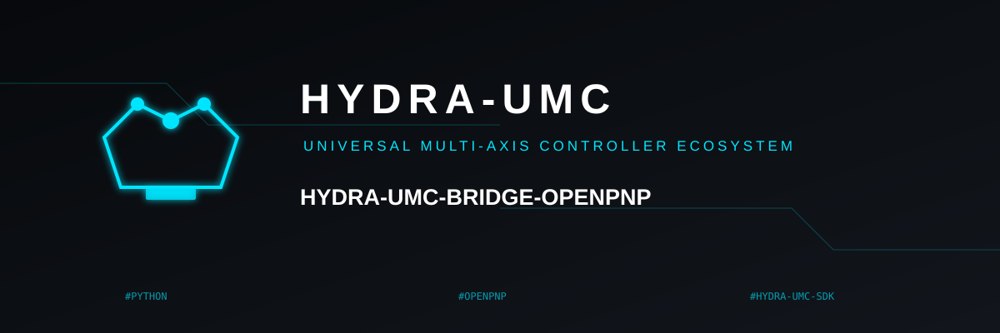
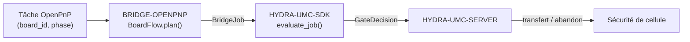

<!-- =============================================================================
HYDRA-UMC-BRIDGE-OPENPNP - Pont de flux de cartes pour OpenPnP
Copyright (C) 2026 JuanenRac (Electro Hobby 3D) <electrohobby3d@gmail.com>
GPL-3.0-or-later - see LICENSE
============================================================================= -->

<p align="center">
  
</p>

# 🎯 HYDRA-UMC-BRIDGE-OPENPNP

<p align="center"><a href="README.md">🇺🇸 English</a> | <a href="README_spa.md">🇪🇸 Español</a> | 🇫🇷 <b>Français</b> | <a href="README_ita.md">🇮🇹 Italiano</a> | <a href="README_deu.md">🇩🇪 Deutsch</a> | <a href="README_zho.md">🇨🇳 简体中文</a> | <a href="README_jpn.md">🇯🇵 日本語</a></p>

### 📋 Pont de coordination de flux de cartes traçable pour OpenPnP

<p align="left">
  
  
  
</p>

---

## 1. 🛠️ APERÇU TECHNIQUE

**HYDRA-UMC-BRIDGE-OPENPNP** est le pont haut niveau de flux de cartes entre HYDRA-UMC et OpenPnP. Il coordonne la préparation des PCB, le chargement par robot, le placement natif, le déchargement par robot et l'achèvement traçable. Il n'implémente ni la cinématique de placement, ni le contrôle des chargeurs, ni le mouvement brut — tout cela reste entièrement à l'intérieur d'OpenPnP.

Il appartient à la famille **External Automation Bridges** : un ensemble de dépôts frères (CNC, LASER, OPENPNP, PRINTER3D, ROS2) qui partagent le même contrat de sécurité de `HYDRA-UMC-SDK`, afin qu'aucun pont ne puisse inventer sa propre définition du « sûr pour travailler ».

### Fonctionnalités clés :
* ✅ **Noyau de flux de cartes traçable, réel :** `board_flow.py` — `BoardFlow.plan()` rejette toute tâche dont le `board_id` est vide ou comporte des espaces en début/fin *avant même* d'évaluer le portail de sécurité ; chaque transfert doit porter un identifiant stable et propre. *(implémenté, testé dans `tests/test_board_flow.py`)*
* ✅ **Carte de transfert par phase, réelle :** un dictionnaire fixe associe chaque `JobPhase` (`PREPARE`, `LOAD`, `PROCESS`, `UNLOAD`, `COMPLETE`, `ABORT`) à une description explicite et lisible du transfert — `verify-board-and-fixture`, `robot-loads-board-into-pnp-fixture`, `openpnp-places-declared-job`, etc. *(implémenté)*
* ✅ **Portail de sécurité partagé, réel :** chaque tâche valide est évaluée via `evaluate_job()` du `bridge_contract` de `HYDRA-UMC-SDK`, le même portail utilisé par tous les ponts frères et HYDRA-UMC-SERVER ; un transfert productif n'avance que lorsque la machine externe rapporte `IDLE` et que la cellule HYDRA-UMC est `READY`. *(implémenté)*
* ✅ **Build/test non mutant :** `build-test.bat`/`.sh` compilent le code source et exécutent la suite de tests de traçabilité des cartes et de sécurité intrinsèque sans toucher aux fichiers de version ni au CHANGELOG. *(implémenté, voir COMPILATION & EXÉCUTION ci-dessous)*
* ✅ **Inspection en lecture seule du profil OpenPnP :** `inspect_openpnp_config.py` analyse un `machine.xml` enregistré, tandis que `openpnp-scripts/HYDRA-UMC/inspect_profile.js` est un modèle de script de menu OpenPnP invoqué manuellement ; les deux ne rapportent que la classe et le nombre de composants, et le modèle affiche ce résultat dans une boîte d'information sans envoyer de commande machine. *(implémenté, testé)*
* ✅ **Simulation de transfert uniquement traçable :** `BoardIdentity` lie les identifiants de carte, recette, révision et lot avant que `simulate_board_handoff()` applique le portail partagé du SDK ; il n'émet une empreinte SHA-256 déterministe que pour un plan autorisé et n'a aucune E/S OpenPnP, série ou machine. *(implémenté, testé)*

---

## 2. 🔄 FLUX DE COORDINATION DE CARTES



---

## 3. 🧱 ARCHITECTURE ET CHOIX DE CONCEPTION

* **Pourquoi la validation du `board_id` a lieu avant toute autre chose dans `plan()`.** La toute première vérification de `BoardFlow.plan()` est `not board_id or board_id.strip() != board_id` — un identifiant de carte malformé ou ambigu est rejeté immédiatement, avec une raison explicite, plutôt que transmis en aval où il serait plus difficile à tracer.
* **Pourquoi les transferts sont un dictionnaire fixe indexé par `JobPhase`, et non un formatage de chaîne.** `BoardFlow._handoffs` associe chacune des six phases prises en charge à une description littérale et non ambiguë. Une future phase inconnue est rejetée comme `unrecognized-phase` ; elle ne peut pas devenir un transfert autorisé simplement parce que le portail commun du SDK est prêt.
* **Pourquoi le pont ne planifie un transfert productif que lorsque la machine externe est `IDLE` et la cellule `READY`.** Le transfert de carte est une opération physique à deux acteurs ; si l'un des deux côtés n'est pas dans un état connu et sûr, planifier un transfert reviendrait à demander à un robot de se déplacer vers une machine imprévisible.
* **Pourquoi `ABORT` peut toujours être demandé pendant un défaut.** `JobPhase.ABORT` est associé à `request-controlled-stop`, que le portail partagé `evaluate_job()` ne bloque pas de la même manière que les phases productives — un opérateur ou un superviseur doit toujours pouvoir demander un arrêt contrôlé, même en plein défaut.
* **Pourquoi l'extension/API OpenPnP en direct reste reportée.** Le profil machine enregistré peut désormais être inspecté en lecture seule, mais choisir une interface de plugin ou une surface en direct exige toujours une session d'essai non productive ; cela évite d'intégrer des hypothèses de mouvement ou de chargeur non vérifiées.
* **Comment cela s'intègre dans le reste de l'écosystème.** BRIDGE-OPENPNP se situe entre une tâche OpenPnP et `HYDRA-UMC-SDK` → `HYDRA-UMC-SERVER` → sécurité de cellule : il coordonne le côté robotique d'un transfert de carte, il ne revendique jamais la cinématique de placement ni le contrôle des chargeurs qui appartiennent à OpenPnP lui-même.

---

## 📂 STRUCTURE DES RÉPERTOIRES

```text
HYDRA-UMC-BRIDGE-OPENPNP/
├── src/
│   └── hydra_umc_bridge_openpnp/
│       ├── __init__.py
│       └── board_flow.py        # BoardFlow : validation board_id + portail de transfert par phase
├── tests/
│   └── test_board_flow.py       # Tests de traçabilité des cartes et de sécurité
├── tools/
│   ├── build_test.py            # Compilateur + lanceur de tests non mutant (build-test.bat/.sh)
│   └── bump_version.py          # Synchronise pyproject.toml, manifeste et CHANGELOG.md
├── build-test.bat / build-test.sh  # Valide uniquement, ne modifie jamais le dépôt
├── build.bat / build.sh            # Valide puis, si succès, incrémente version + CHANGELOG
├── pyproject.toml               # Métadonnées du paquet ; dépend de HYDRA-UMC-SDK (git)
├── hydra-umc.project.json       # Manifeste de l'écosystème (version, maturité, famille)
├── CHANGELOG.md
├── CODE_OF_CONDUCT.md / CONTRIBUTING.md / SECURITY.md / SUPPORT.md
├── LICENSE / LICENSE.md
└── README.md / README_*.md      # Ce fichier et ses 6 traductions
```

---

## 4. ⚙️ COMPILATION ET EXÉCUTION

Nécessite Python 3.11+. `tools/build_test.py` attend que `HYDRA-UMC-SDK` soit cloné en tant que répertoire frère (`../HYDRA-UMC-SDK`) ou indiqué via la variable d'environnement `HYDRA_UMC_SDK_ROOT`.

```bash
# Windows
build-test.bat      # validation uniquement — pas de changement de version/CHANGELOG
build.bat            # valide puis, si succès, incrémente version + CHANGELOG

# Linux/macOS
bash build-test.sh
bash build.sh
```

`build-test` compile chaque module sous `src/` avec `py_compile` et exécute la suite complète `unittest` (`tests/test_board_flow.py`), démontrant le rejet par traçabilité des cartes et le portail de sécurité — il ne modifie jamais le dépôt. `build` exécute d'abord cette même validation et, seulement en cas de succès, appelle `tools/bump_version.py` pour synchroniser la version dans `pyproject.toml`, `hydra-umc.project.json` et `CHANGELOG.md`. Il n'existe pas encore de commande `run` machine réelle — cela nécessite une intégration OpenPnP validée.

---

## ✅ ÉTAT ACTUEL ET PROCHAINES ÉTAPES

**Réel aujourd'hui :** version `0.0.6`, un noyau de transfert de PCB traçable testé localement (`BoardFlow`) adossé au portail de tâches partagé de `HYDRA-UMC-SDK`, une suite `unittest` déterministe de dix tests, un inspecteur de profil enregistré, un modèle de menu OpenPnP visible en lecture seule et une simulation liée à l'identité sans E/S machine.

**Frontière d'intégration :** OpenPnP conserve à tout moment la cinématique de placement, le contrôle des chargeurs et le mouvement brut ; ce pont ne fait que réguler et tracer le *transfert* autour de cela — chargement par robot, achèvement du placement natif, déchargement par robot.

**Encore à venir :** aucune connexion en direct à une machine OpenPnP n'est revendiquée — l'extension/API concrète ne sera choisie que dans une session isolée non productive avec un opérateur présent.

---

## 🔗 PROJETS LIÉS

Ce projet fait partie d'un écosystème robotique plus large du même auteur (JuanenRac / Electro Hobby 3D), couvrant firmware, logiciel de contrôle, nœuds d'IA et outillage de flotte. Cela vaut la peine de le savoir, car une demande pourrait en réalité concerner l'un de ces projets plutôt que ce dépôt.

### Directement liés

- **[HYDRA-UMC-SDK](https://github.com/JuanenRac/HYDRA-UMC-SDK)** — le portail partagé de tâches et de sécurité à travers lequel ce pont (et tous les autres) évalue ses tâches.
- **[HYDRA-UMC-SERVER](https://github.com/JuanenRac/HYDRA-UMC-SERVER)** — la frontière d'orchestration autorisée à laquelle ce pont rend compte.
- **[HYDRA-UMC-SAFETY-ZONES](https://github.com/JuanenRac/HYDRA-UMC-SAFETY-ZONES)** — future preuve de zone de cellule.

### Reste de l'écosystème

**Plateforme HYDRA-UMC** — la micro-usine multi-robot pour laquelle ce pont coordonne les auxiliaires
- **[HYDRA-UMC](https://github.com/JuanenRac/HYDRA-UMC)** — la carte mère CM5 + STM32H745 orchestrant jusqu'à 8 bras robotiques.
- **[HYDRA-UMC-SERVER](https://github.com/JuanenRac/HYDRA-UMC-SERVER)** — le backend Express/WebSocket auquel parlent tous les clients de contrôle et ponts.
- **[HYDRA-UMC-STUDIO](https://github.com/JuanenRac/HYDRA-UMC-STUDIO)** — tableau de bord web, visualisation 3D multi-robot.

**External Automation Bridges** — dépôts frères partageant ce même portail de tâches `HYDRA-UMC-SDK`
- **[HYDRA-UMC-BRIDGE-CNC](https://github.com/JuanenRac/HYDRA-UMC-BRIDGE-CNC)** — pont de coordination de cellule CNC.
- **[HYDRA-UMC-BRIDGE-LASER](https://github.com/JuanenRac/HYDRA-UMC-BRIDGE-LASER)** — pont de coordination de cellules laser.
- **[HYDRA-UMC-BRIDGE-PRINTER3D](https://github.com/JuanenRac/HYDRA-UMC-BRIDGE-PRINTER3D)** — pont de coordination pour logiciels d'impression 3D ouverts.
- **[HYDRA-UMC-BRIDGE-ROS2](https://github.com/JuanenRac/HYDRA-UMC-BRIDGE-ROS2)** — frontière de coordination bidirectionnelle avec ROS 2.

**Preuves de sécurité et d'intégration**
- **[HYDRA-UMC-SAFETY-ZONES](https://github.com/JuanenRac/HYDRA-UMC-SAFETY-ZONES)** — preuves de sécurité des zones de cellule utilisées dans toute la famille de ponts.
- **[HYDRA-UMC-HIL-BRIDGE](https://github.com/JuanenRac/HYDRA-UMC-HIL-BRIDGE)** — preuves de tests hardware-in-the-loop.

## 👤 AUTEUR
**JuanenRac** (Electro Hobby 3D)
📧 electrohobby3d@gmail.com

## 📜 LICENCE
GPL-3.0 - Voir LICENSE pour les détails.

## 🛠️ COMPILATION ET EXÉCUTION

Utilisez la vérification de compilation sans versionnage avant une compilation de publication :

| Action | Windows | Linux / macOS |
|---|---|---|
| Vérification de compilation (sans changement de version ni CHANGELOG) | `build-test.bat` | `./build-test.sh` |
| Exécution / développement (le cas échéant) | `run*.bat` ou `dev*.bat` | `./run*.sh` ou `./dev*.sh` |

`build-test.bat` et `build-test.sh` compilent ou valident la pile du projet sans incrémenter `hydra-umc.project.json` ni modifier `CHANGELOG.md`. Ils ne peuvent produire que la sortie normale du compilateur. Les scripts `build*.bat`, `build*.sh`, `run*` et `dev*` existants conservent leur comportement propre au projet, versionné ou d'exécution ; utilisez-les lorsque ce comportement est requis.
