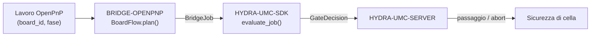

<!-- =============================================================================
HYDRA-UMC-BRIDGE-OPENPNP - Ponte di flusso schede per OpenPnP
Copyright (C) 2026 JuanenRac (Electro Hobby 3D) <electrohobby3d@gmail.com>
GPL-3.0-or-later - see LICENSE
============================================================================= -->

<p align="center">
  
</p>

# 🎯 HYDRA-UMC-BRIDGE-OPENPNP

<p align="center"><a href="README.md">🇺🇸 English</a> | <a href="README_spa.md">🇪🇸 Español</a> | <a href="README_fra.md">🇫🇷 Français</a> | 🇮🇹 <b>Italiano</b> | <a href="README_deu.md">🇩🇪 Deutsch</a> | <a href="README_zho.md">🇨🇳 简体中文</a> | <a href="README_jpn.md">🇯🇵 日本語</a></p>

### 📋 Ponte di coordinamento tracciabile del flusso schede per OpenPnP

<p align="left">
  
  
  
</p>

---

## 1. 🛠️ PANORAMICA TECNICA

**HYDRA-UMC-BRIDGE-OPENPNP** è il ponte di alto livello per il flusso schede tra HYDRA-UMC e OpenPnP. Coordina la preparazione dei PCB, il carico da parte del robot, il posizionamento nativo, lo scarico da parte del robot e il completamento tracciabile. Non implementa la cinematica di posizionamento, il controllo dei feeder o il movimento grezzo — tutto ciò resta interamente all'interno di OpenPnP.

Appartiene alla famiglia **External Automation Bridges**: un insieme di repository fratelli (CNC, LASER, OPENPNP, PRINTER3D, ROS2) che condividono lo stesso contratto di sicurezza di `HYDRA-UMC-SDK`, così nessun ponte può inventare una propria definizione di "sicuro per lavorare".

### Caratteristiche principali:
* ✅ **Nucleo tracciabile di flusso schede, reale:** `board_flow.py` — `BoardFlow.plan()` rifiuta qualsiasi lavoro il cui `board_id` sia vuoto o presenti spazi iniziali/finali *ancor prima* di valutare la porta di sicurezza; ogni passaggio deve portare un identificatore stabile e pulito. *(implementato, testato in `tests/test_board_flow.py`)*
* ✅ **Mappa di passaggio per fase, reale:** un dizionario fisso associa ogni `JobPhase` (`PREPARE`, `LOAD`, `PROCESS`, `UNLOAD`, `COMPLETE`, `ABORT`) a una descrizione esplicita e leggibile del passaggio — `verify-board-and-fixture`, `robot-loads-board-into-pnp-fixture`, `openpnp-places-declared-job`, ecc. *(implementato)*
* ✅ **Porta di sicurezza condivisa, reale:** ogni lavoro valido viene valutato tramite `evaluate_job()` del `bridge_contract` di `HYDRA-UMC-SDK`, la stessa porta usata da tutti i ponti fratelli e da HYDRA-UMC-SERVER; un passaggio produttivo procede solo quando la macchina esterna riporta `IDLE` e la cella HYDRA-UMC è `READY`. *(implementato)*
* ✅ **Build/test non mutante:** `build-test.bat`/`.sh` compilano il codice sorgente ed eseguono la suite di test di tracciabilità delle schede e fail-safe senza toccare i file di versione o il CHANGELOG. *(implementato, vedi COMPILAZIONE ED ESECUZIONE più sotto)*
* ✅ **Ispezione del profilo OpenPnP in sola lettura:** `inspect_openpnp_config.py` analizza un `machine.xml` salvato, mentre `openpnp-scripts/HYDRA-UMC/inspect_profile.js` è un modello di script del menu OpenPnP invocato manualmente; entrambi riportano solo classe e conteggi dei componenti e il modello mostra il risultato in una finestra informativa senza inviare comandi alla macchina. *(implementato, testato)*
* ✅ **Simulazione di passaggio solo tracciabile:** `BoardIdentity` associa identificatori di scheda, ricetta, revisione e lotto prima che `simulate_board_handoff()` applichi la porta condivisa dell'SDK; emette un'impronta SHA-256 deterministica solo per un piano consentito e non ha I/O OpenPnP, seriale o macchina. *(implementato, testato)*
* ✅ **Simulazione del ciclo produttivo solo tracciabile:** `simulate_board_cycle()` valuta la sequenza ordinata `PREPARE → LOAD → PROCESS → UNLOAD → COMPLETE` sotto uno stato esplicito cella/macchina; ogni passaggio produttivo fallisce chiuso fuori da `READY/IDLE`, e `ABORT` resta separato nel percorso di sicurezza dell'SDK. *(implementato, testato)*
* ✅ **Contratto di evidenza deterministico:** `docs/HANDOFF_EVIDENCE.md` definisce lo schema `1.0` emesso da entrambi i simulatori. Trasporta solo fase, decisione, motivo e impronta di identità consentita; i valori grezzi di scheda, ricetta, revisione e lotto non entrano mai nel record JSON. *(implementato, testato)*

---

## 2. 🔄 FLUSSO DI COORDINAMENTO DELLE SCHEDE



---

## 3. 🧱 ARCHITETTURA E DECISIONI DI PROGETTAZIONE

* **Perché la validazione di `board_id` avviene prima di qualsiasi altra cosa in `plan()`.** Il primissimo controllo di `BoardFlow.plan()` è `not board_id or board_id.strip() != board_id` — un identificatore di scheda malformato o ambiguo viene rifiutato immediatamente, con una motivazione esplicita, invece di essere inoltrato a valle dove sarebbe più difficile da tracciare.
* **Perché i passaggi sono un dizionario fisso indicizzato per `JobPhase`, non una formattazione di stringhe.** `BoardFlow._handoffs` mappa ciascuna delle sei fasi supportate su una descrizione letterale e univoca. Una futura fase sconosciuta viene rifiutata come `unrecognized-phase`; non può diventare un passaggio consentito solo perché la porta comune dell'SDK è pronta.
* **Perché il ponte pianifica un trasferimento produttivo solo quando la macchina esterna è `IDLE` e la cella è `READY`.** Il passaggio di schede è un'operazione fisica a due parti; se uno dei due lati non è in uno stato sicuro e noto, pianificare un trasferimento significherebbe chiedere a un robot di muoversi verso una macchina imprevedibile.
* **Perché `ABORT` può comunque essere richiesto durante un guasto.** `JobPhase.ABORT` viene mappato su `request-controlled-stop`, che la porta condivisa `evaluate_job()` non blocca allo stesso modo in cui blocca le fasi produttive — un operatore o un supervisore deve sempre poter richiedere un arresto controllato, anche in pieno guasto.
* **Perché l'estensione/API OpenPnP dal vivo resta rimandata.** Il profilo macchina salvato può ora essere ispezionato in sola lettura, ma scegliere un'interfaccia plugin o una superficie dal vivo richiede ancora una sessione di prova non produttiva; ciò evita di incorporare ipotesi non verificate di movimento o feeder.
* **Come si inserisce nel resto dell'ecosistema.** BRIDGE-OPENPNP si trova tra un lavoro OpenPnP e `HYDRA-UMC-SDK` → `HYDRA-UMC-SERVER` → sicurezza di cella: coordina il lato robotico di un passaggio di schede, non rivendica mai la cinematica di posizionamento o il controllo dei feeder che appartengono a OpenPnP stesso.

---

## 📂 STRUTTURA DELLE DIRECTORY

```text
HYDRA-UMC-BRIDGE-OPENPNP/
├── src/
│   └── hydra_umc_bridge_openpnp/
│       ├── __init__.py
│       ├── board_flow.py        # BoardFlow: validazione board_id + porta di passaggio per fase
│       ├── configuration.py     # Ispeziona un XML macchina OpenPnP senza aprire o modificare alcuna macchina
│       ├── evidence.py          # Evidenza deterministica e non sensibile da simulazioni solo locali
│       ├── handoff.py           # Valida/simula un passaggio PCB tracciabile - non importa mai OpenPnP né tocca I/O
│       └── mqtt_transport.py    # Trasporto MQTT reale - qui non esiste alcun trasporto macchina reale
├── tests/
│   ├── test_board_flow.py       # Test di tracciabilità delle schede e fail-safe
│   └── test_mqtt_transport.py   # Test di forma evidenza/stato MQTT contro un client broker fittizio
├── tools/
│   ├── build_test.py            # Compilatore + esecutore di test non mutante (build-test.bat/.sh)
│   └── bump_version.py          # Sincronizza pyproject.toml, manifesto e CHANGELOG.md
├── docs/
│   ├── BRIDGE_GUIDE.md          # Ambito, piattaforme compatibili, script, porta di accettazione hardware
│   └── HANDOFF_EVIDENCE.md      # Cosa conta come evidenza di passaggio reale e cosa questo bridge rifiuta di dedurre
├── images/
│   └── HYDRA_UMC_BANNER.svg     # Banner del README
├── build-test.bat / build-test.sh  # Solo valida, non modifica mai il repository
├── build.bat / build.sh            # Valida e, solo in caso di successo, aggiorna versione + CHANGELOG
├── pyproject.toml               # Metadati del pacchetto; dipende da HYDRA-UMC-SDK (git)
├── hydra-umc.project.json       # Manifesto dell'ecosistema (versione, maturità, famiglia)
├── CHANGELOG.md
├── CODE_OF_CONDUCT.md / CONTRIBUTING.md / SECURITY.md / SUPPORT.md
├── LICENSE / LICENSE.md
└── README.md / README_*.md      # Questo file e le sue 6 traduzioni
```

---

## 4. ⚙️ COMPILAZIONE ED ESECUZIONE

Richiede Python 3.11+. `tools/build_test.py` si aspetta che `HYDRA-UMC-SDK` sia clonato come directory fratella (`../HYDRA-UMC-SDK`) o indicato tramite la variabile d'ambiente `HYDRA_UMC_SDK_ROOT`.

```bash
# Windows
build-test.bat      # solo validazione — nessun cambio di versione/CHANGELOG
build.bat            # valida e, se ha successo, aggiorna versione + CHANGELOG

# Linux/macOS
bash build-test.sh
bash build.sh
```

`build-test` compila ogni modulo sotto `src/` con `py_compile` ed esegue l'intera suite `unittest` (`tests/test_board_flow.py`), dimostrando il rifiuto per tracciabilità delle schede e la porta fail-safe — non modifica mai il repository. `build` esegue prima quella stessa validazione e, solo in caso di successo, chiama `tools/bump_version.py` per sincronizzare la versione in `pyproject.toml`, `hydra-umc.project.json` e `CHANGELOG.md`. Non esiste ancora un comando `run` macchina reale — serve un'integrazione OpenPnP validata.

---

## ✅ STATO ATTUALE E PROSSIMI PASSI

**Reale oggi:** versione `0.1.1`, un nucleo di passaggio PCB tracciabile testato in locale (`BoardFlow`) appoggiato sulla porta di lavoro condivisa di `HYDRA-UMC-SDK`, una suite `unittest` deterministica di ventotto test, un ispettore di profilo salvato che riporta evidenza reale di attuatori/segnalatori/punte ugello OpenPnP insieme ai conteggi di teste/telecamere/driver/alimentatori, un modello visibile di menu OpenPnP in sola lettura, simulazioni di passaggio/ciclo legate all'identità e un contratto JSON di evidenza non sensibile verificato da CI senza I/O macchina.

**Confine di integrazione:** OpenPnP mantiene sempre la cinematica di posizionamento, il controllo dei feeder e il movimento grezzo; questo ponte regola e traccia solo il *passaggio* attorno ad esso — carico da parte del robot, completamento del posizionamento nativo, scarico da parte del robot.

**Ancora da fare:** non viene rivendicata alcuna connessione dal vivo a una macchina OpenPnP — l'estensione/API concreta verrà scelta solo in una sessione isolata non produttiva con un operatore presente.

---

## 🔗 Progetti Correlati

Questo progetto fa parte dell'ecosistema robotico HYDRA-UMC dello stesso autore (JuanenRac / Electro Hobby 3D). Vale la pena conoscerlo, poiché una richiesta potrebbe in realtà riguardare uno di questi invece di questo repository.

**Progetto Padre**
- **[HYDRA-UMC-SERVER](https://github.com/JuanenRac/HYDRA-UMC-SERVER)** — il vero backend headless (REST/WebSocket) con cui parla davvero ogni client di controllo; il confine autenticato dell'ecosistema a cui questo bridge riporta una volta che ogni comando ha superato la barriera di sicurezza locale di questo stesso bridge.

**Progetti Fratelli** — parlano anch'essi con la stessa API di HYDRA-UMC-SERVER, ciascuno come proprio client
- **[HYDRA-UMC-STUDIO](https://github.com/JuanenRac/HYDRA-UMC-STUDIO)** — dashboard di controllo web con visualizzazione 3D multi-robot in tempo reale.
- **[HYDRA-UMC-SUITE](https://github.com/JuanenRac/HYDRA-UMC-SUITE)** — centro di comando sciame desktop (PySide6) per più server contemporaneamente, pacchettizzato come eseguibile standalone.
- **[HYDRA-UMC-ANDROID-CONTROL](https://github.com/JuanenRac/HYDRA-UMC-ANDROID-CONTROL)** — app di controllo nativa per Android con login biometrico e un companion Wear OS abbinato.
- **[HYDRA-UMC-IOS-CONTROL](https://github.com/JuanenRac/HYDRA-UMC-IOS-CONTROL)** — app di controllo per iOS/iPadOS (Flutter) con sincronizzazione WebSocket in tempo reale.
- **[HYDRA-UMC-DSI](https://github.com/JuanenRac/HYDRA-UMC-DSI)** — interfaccia touch nativa per il touchscreen DSI da 7" a bordo, incorporata direttamente nel CM5.
- **[HYDRA-UMC-BRIDGE-AMR](https://github.com/JuanenRac/HYDRA-UMC-BRIDGE-AMR)** — barriera di coordinamento per flotte AGV/AMR tramite un publisher MQTT VDA 5050 reale.
- **[HYDRA-UMC-BRIDGE-CNC](https://github.com/JuanenRac/HYDRA-UMC-BRIDGE-CNC)** — coordinatore ad alto livello per celle CNC con accesso reale a stato/byte di controllo GRBL.
- **[HYDRA-UMC-BRIDGE-DROIDS](https://github.com/JuanenRac/HYDRA-UMC-BRIDGE-DROIDS)** — barriera di coordinamento per droidi con zampe/umanoidi, con un vero mittente di comandi per Boston Dynamics Spot.
- **[HYDRA-UMC-BRIDGE-LASER](https://github.com/JuanenRac/HYDRA-UMC-BRIDGE-LASER)** — coordinatore di sicurezza per celle laser che legge 3 salvaguardie GPIO reali di chiave/involucro/interblocco.
- **[HYDRA-UMC-BRIDGE-PRINTER3D](https://github.com/JuanenRac/HYDRA-UMC-BRIDGE-PRINTER3D)** — barriera di coordinamento sicura per stampanti 3D Moonraker/Klipper, con comandi di lavoro reali e controllati.
- **[HYDRA-UMC-BRIDGE-ROS2](https://github.com/JuanenRac/HYDRA-UMC-BRIDGE-ROS2)** — coordinatore di sicurezza con un vero trasporto ROS 2 rclpy, importato in modo lazy.
- **[HYDRA-UMC-BRIDGE-UAV](https://github.com/JuanenRac/HYDRA-UMC-BRIDGE-UAV)** — barriera di coordinamento per UAV dotati di fotocamera, con un vero mittente di comandi MAVLink.

**Direttamente Correlati**
- **[HYDRA-UMC-SDK](https://github.com/JuanenRac/HYDRA-UMC-SDK)** — il contratto JSON-Schema condiviso e la barriera di sicurezza contro cui ogni bridge valida i propri comandi.
- **[HYDRA-UMC-MQTT-BROKER](https://github.com/JuanenRac/HYDRA-UMC-MQTT-BROKER)** — il vero trasporto di `mqtt_transport.py` per i propri topic `hydra/bridges/openpnp/...` di questo bridge — la barriera di lavoro più una simulazione di passaggio di consegne completamente tracciabile, senza topic `state` poiché qui non c'è alcun trasporto macchina reale da osservare; vedi il proprio `docs/BRIDGE_TOPICS.md` di quel repository.
- **[HYDRA-UMC-SAFETY-ZONES](https://github.com/JuanenRac/HYDRA-UMC-SAFETY-ZONES)** — futura evidenza di sicurezza della zona cella per questo bridge.

**Fa Anche Parte dell'Ecosistema**

*Hardware e Piattaforma di Base*
- **[HYDRA-UMC](https://github.com/JuanenRac/HYDRA-UMC)** — la scheda madre fisica del braccio robotico: host CM5 + coprocessore STM32H745 dual-core, che coordina fino a 8 bracci utensile via CAN-OTA/SPI-OTA.
- **[HYDRA-UMC-OS](https://github.com/JuanenRac/HYDRA-UMC-OS)** — livello prodotto riproducibile su Raspberry Pi OS per il CM5: agente in sola lettura, config/profili validati, provisioning WiFi al primo contatto.

*Backend Centrale e Client*
- **[HYDRA-UMC-EDITOR-URDF](https://github.com/JuanenRac/HYDRA-UMC-EDITOR-URDF)** — creatore/editor grafico desktop di URDF che invia i modelli finiti al catalogo di STUDIO.

*Piattaforma Strumenti URTC*
- **[URTC](https://github.com/JuanenRac/URTC)** — firmware per la scheda fisica dell'Universal Robot Tool Controller, oltre 25 profili utensile su bus CAN.
- **[URTC-FLASHER](https://github.com/JuanenRac/URTC-FLASHER)** — strumento desktop con GUI per il flashing delle schede URTC, CAN-OTA più SWD/JTAG a chip intero.
- **[URTC-TESTER](https://github.com/JuanenRac/URTC-TESTER)** — strumento desktop di diagnostica CAN-bus dal vivo per schede URTC, un pannello per profilo utensile.
- **[URTC-WEB-STUDIO](https://github.com/JuanenRac/URTC-WEB-STUDIO)** — alternativa basata su browser a URTC-TESTER tramite la Web Serial API, senza installazione locale.

*Nodo IA Visione (Hailo-8)*
- **[HYDRA-UMC-VISION-NODE](https://github.com/JuanenRac/HYDRA-UMC-VISION-NODE)** — hub di integrazione per la pipeline di visione Hailo-8, con un vero controllo di prontezza hardware per fase.
- **[HYDRA-UMC-DETECTION-HEF](https://github.com/JuanenRac/HYDRA-UMC-DETECTION-HEF)** — registro reale di modelli compilati con verifica di caricamento sicuro per architettura Hailo/checksum.
- **[HYDRA-UMC-VISION-STREAMER](https://github.com/JuanenRac/HYDRA-UMC-VISION-STREAMER)** — generatore reale di pipeline GStreamer + config MediaMTX, con una vera barriera di integrazione HailoRT.
- **[HYDRA-UMC-VISUAL-SERVOING-API](https://github.com/JuanenRac/HYDRA-UMC-VISUAL-SERVOING-API)** — vera legge di correzione Position-Based Visual Servoing, con cancello di sicurezza sullo stato di zona a monte.

*Nodo IA Cognitivo (Hailo-10)*
- **[HYDRA-UMC-COGNITIVE-NODE](https://github.com/JuanenRac/HYDRA-UMC-COGNITIVE-NODE)** — hub di integrazione per la pipeline cognitiva Hailo-10 (orchestrazione LLM/VLA/voce).
- **[HYDRA-UMC-VLA-ENGINE](https://github.com/JuanenRac/HYDRA-UMC-VLA-ENGINE)** — vera codifica/decodifica di token d'azione e generazione di traiettoria per un modello Vision-Language-Action.
- **[HYDRA-UMC-VOICE-UI](https://github.com/JuanenRac/HYDRA-UMC-VOICE-UI)** — vero front-end vocale (VAD + parser di intenti) con un relay verso Watch limitato e soggetto a conferma.
- **[HYDRA-UMC-SEMANTIC-PLANNER](https://github.com/JuanenRac/HYDRA-UMC-SEMANTIC-PLANNER)** — vera scomposizione dei task basata su regole e recupero semantico degli errori sui codici errore MCU.
- **[HYDRA-UMC-DOCS-QA](https://github.com/JuanenRac/HYDRA-UMC-DOCS-QA)** — vera ricerca documentale TF-IDF (solo libreria standard) sui documenti Markdown di questo ecosistema.

*Orchestrazione e Sciame*
- **[HYDRA-UMC-ORCHESTRATOR](https://github.com/JuanenRac/HYDRA-UMC-ORCHESTRATOR)** — hub di integrazione con un vero contratto di health-report gRPC/Protobuf e una macchina a stati di missione.
- **[HYDRA-UMC-JOB-DISPATCHER](https://github.com/JuanenRac/HYDRA-UMC-JOB-DISPATCHER)** — vera coda di lavori basata su priorità con deduplicazione, su una vera API HTTP.
- **[HYDRA-UMC-NODE-HEALING](https://github.com/JuanenRac/HYDRA-UMC-NODE-HEALING)** — vero watchdog di salute della flotta basato su gRPC, con retry/backoff e rilevamento di discrepanza d'identità.
- **[HYDRA-UMC-PATH-PLANNER-3D](https://github.com/JuanenRac/HYDRA-UMC-PATH-PLANNER-3D)** — vero pianificatore di percorsi 3D basato su RRT, con vera validazione delle collisioni ostacolo/spazio di lavoro.
- **[HYDRA-UMC-SWARM-SYNC](https://github.com/JuanenRac/HYDRA-UMC-SWARM-SYNC)** — vera sincronizzazione di stato CRDT LWW-Element-Map, con property test per la convergenza multi-cella.

*Gemello Digitale e Simulazione*
- **[HYDRA-UMC-TWIN](https://github.com/JuanenRac/HYDRA-UMC-TWIN)** — hub di integrazione per il motore di gemello digitale, con un vero contratto di sincronizzazione per compatibilità di versione.
- **[HYDRA-UMC-HIL-BRIDGE](https://github.com/JuanenRac/HYDRA-UMC-HIL-BRIDGE)** — vero interblocco di sicurezza hardware-in-the-loop che instrada i comandi tra simulazione e hardware reale.
- **[HYDRA-UMC-PHYSICS-REPLICA](https://github.com/JuanenRac/HYDRA-UMC-PHYSICS-REPLICA)** — vera cinematica diretta e validazione dei limiti articolari su un vero sottoinsieme URDF.
- **[HYDRA-UMC-SYNTHETIC-DATA-GEN](https://github.com/JuanenRac/HYDRA-UMC-SYNTHETIC-DATA-GEN)** — vero generatore procedurale di scene 2D con esportazione di annotazioni YOLO/COCO.

*Dati e Analisi*
- **[HYDRA-UMC-DATALAKE](https://github.com/JuanenRac/HYDRA-UMC-DATALAKE)** — vero archivio di serie temporali basato su sqlite3, con una vera API HTTP di ingestione/query.
- **[HYDRA-UMC-ANOMALY-DETECTOR](https://github.com/JuanenRac/HYDRA-UMC-ANOMALY-DETECTOR)** — vero rilevatore di anomalie FFT + baseline statistica, con monitoraggio della deriva.
- **[HYDRA-UMC-PRODUCTION-REPORTS](https://github.com/JuanenRac/HYDRA-UMC-PRODUCTION-REPORTS)** — vero calcolo OEE/disponibilità sullo storico di DATALAKE, con esportazione CSV riproducibile.
- **[HYDRA-UMC-TELEMETRY-COLLECTOR](https://github.com/JuanenRac/HYDRA-UMC-TELEMETRY-COLLECTOR)** — vera pipeline di ingestione CAN/WebSocket verso DATALAKE, con deduplicazione per sequenza.

*Gateway Industriale*
- **[HYDRA-UMC-GATEWAY-INDUSTRIAL](https://github.com/JuanenRac/HYDRA-UMC-GATEWAY-INDUSTRIAL)** — hub di integrazione che inoltra ai protocolli industriali, con un vero livello di allowlist dei comandi/backpressure.
- **[HYDRA-UMC-OPCUA-SERVER](https://github.com/JuanenRac/HYDRA-UMC-OPCUA-SERVER)** — vero spazio di indirizzi OPC-UA, verificato con una vera sessione client del protocollo binario.
- **[HYDRA-UMC-MTCONNECT-ADAPTER](https://github.com/JuanenRac/HYDRA-UMC-MTCONNECT-ADAPTER)** — veri endpoint XML `/probe` e `/current` di MTConnect, con output in modalità degradata.

*Strumenti Complementari e Operazioni dell'Ecosistema*
- **[HYDRA-UMC-DASHBOARD-AI](https://github.com/JuanenRac/HYDRA-UMC-DASHBOARD-AI)** — pannelli Smart Summaries e Anomaly Highlighting su DATALAKE/ANOMALY-DETECTOR, con un fallback statistico onesto.
- **[HYDRA-UMC-TOOL-CLI](https://github.com/JuanenRac/HYDRA-UMC-TOOL-CLI)** — CLI di flotta con un vero e stabile contratto di exit-code, un client live reale della stessa API di HYDRA-UMC-SERVER.
- **[HYDRA-UMC-WATCH](https://github.com/JuanenRac/HYDRA-UMC-WATCH)** — app companion WearOS con avvisi aptici reali e un relay vocale verso il telefono abbinato.
- **[URTC-SMART-RACK](https://github.com/JuanenRac/URTC-SMART-RACK)** — firmware per un rack di montaggio schede con decodifica reale dell'ID utensile e logica di preriscaldamento Smart Idle.
- **[URTC-VISION-TOOL](https://github.com/JuanenRac/URTC-VISION-TOOL)** — firmware più un vero companion di visione Python per una testa utensile di ispezione termica/RGB.
- **[HYDRA-UMC-UPDATER](https://github.com/JuanenRac/HYDRA-UMC-UPDATER)** — strumento amministrativo desktop che scopre, clona e aggiorna ogni repository di questo ecosistema.

## 👤 AUTORE
**JuanenRac** (Electro Hobby 3D)
📧 electrohobby3d@gmail.com
📺 [youtube.com/@electrohobby3d](https://youtube.com/@electrohobby3d)

## 📜 LICENZA
GPL-3.0 - Vedi LICENSE per i dettagli.
