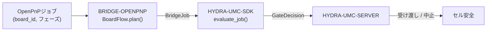

<!-- =============================================================================
HYDRA-UMC-BRIDGE-OPENPNP - OpenPnPボードフローブリッジ
Copyright (C) 2026 JuanenRac (Electro Hobby 3D) <electrohobby3d@gmail.com>
GPL-3.0-or-later - see LICENSE
============================================================================= -->

<p align="center">
  
</p>

# 🎯 HYDRA-UMC-BRIDGE-OPENPNP

<p align="center"><a href="README.md">🇺🇸 English</a> | <a href="README_spa.md">🇪🇸 Español</a> | <a href="README_fra.md">🇫🇷 Français</a> | <a href="README_ita.md">🇮🇹 Italiano</a> | <a href="README_deu.md">🇩🇪 Deutsch</a> | <a href="README_zho.md">🇨🇳 简体中文</a> | 🇯🇵 <b>日本語</b></p>

### 📋 OpenPnP向け追跡可能なボードフロー連携ブリッジ

<p align="left">
  
  
  
</p>

---

## 1. 🛠️ 技術概要

**HYDRA-UMC-BRIDGE-OPENPNP** は、HYDRA-UMCとOpenPnPとを結ぶ高レベルのボードフローブリッジである。PCB準備、ロボット搭載、ネイティブ実装、ロボット取り出し、追跡可能な完了処理を連携させる。実装キネマティクス、フィーダー制御、生の動作は実装しない —— それらは完全にOpenPnP内部にとどまる。

本リポジトリは **External Automation Bridges** ファミリーに属する。CNC・LASER・OPENPNP・PRINTER3D・ROS2という兄弟リポジトリ群が、すべて `HYDRA-UMC-SDK` の同じ安全契約を共有しており、いずれのブリッジも独自の「作業に安全」という定義を勝手に作ることはできない。

### 主な機能:
* ✅ **実在する追跡可能なボードフローコア:** `board_flow.py` の `BoardFlow.plan()` は、安全ゲートを評価する*前に*、`board_id` が空であるか先頭・末尾に空白を含むジョブをすべて拒否する —— すべての受け渡しは安定した、クリーンな識別子を持つことが求められる。*(実装済み、`tests/test_board_flow.py` でテスト済み)*
* ✅ **実在するフェーズ別受け渡しマップ:** 固定辞書が各 `JobPhase`(`PREPARE`、`LOAD`、`PROCESS`、`UNLOAD`、`COMPLETE`、`ABORT`)を明示的で読みやすい受け渡し説明にマッピングする —— `verify-board-and-fixture`、`robot-loads-board-into-pnp-fixture`、`openpnp-places-declared-job` など。*(実装済み)*
* ✅ **実在する共有安全ゲート:** 有効なジョブはすべて `HYDRA-UMC-SDK` の `bridge_contract` にある `evaluate_job()` を通じて評価される。これは他のすべての兄弟ブリッジとHYDRA-UMC-SERVERが使うのと同じゲートである。実際の受け渡しが進むのは、外部機械が `IDLE` を報告し、HYDRA-UMCセルが `READY` である場合のみである。*(実装済み)*
* ✅ **非破壊的なビルド/テスト:** `build-test.bat`/`.sh` はソースをコンパイルし、バージョンファイルやCHANGELOGに一切触れずにボード追跡性とフェイルセーフのテストスイートを実行する。*(実装済み、下記「ビルドと実行」を参照)*
* ✅ **読み取り専用のOpenPnPプロファイル検査:** `inspect_openpnp_config.py` は保存済みの `machine.xml` を解析し、`openpnp-scripts/HYDRA-UMC/inspect_profile.js` は手動で呼び出す OpenPnP メニュースクリプトのテンプレートである。両者はクラスとコンポーネント数のみを報告し、テンプレートは情報ダイアログに結果を表示する。機械コマンドは一切送信しない。*(実装・テスト済み)*
* ✅ **追跡専用の受け渡しシミュレーション:** `BoardIdentity` は `simulate_board_handoff()` が共有 SDK ゲートを適用する前に基板、レシピ、リビジョン、ロットの識別子を束ねる。許可された計画に対してのみ決定論的な SHA-256 追跡指紋を出力し、OpenPnP、シリアル、機械 I/O は一切持たない。*(実装・テスト済み)*
* ✅ **追跡専用の生産サイクルシミュレーション:** `simulate_board_cycle()` は明示的なセル/機械状態で、順序付けられた `PREPARE → LOAD → PROCESS → UNLOAD → COMPLETE` を評価する。各生産ステップは `READY/IDLE` 以外では安全に拒否され、`ABORT` は SDK の安全経路で独立したままである。*(実装・テスト済み)*

---

## 2. 🔄 ボードフロー連携フロー



---

## 3. 🧱 アーキテクチャと設計判断

* **なぜ `board_id` の検証が `plan()` の中で他の何よりも先に行われるのか。** `BoardFlow.plan()` の最初のチェックは `not board_id or board_id.strip() != board_id` である —— 不正または曖昧なボード識別子は、下流に転送されて追跡がより困難になる前に、明示的な理由とともに即座に拒否される。
* **なぜ受け渡しは文字列フォーマットではなく `JobPhase` をキーとする固定辞書なのか。** `BoardFlow._handoffs` はサポートされる6つのフェーズそれぞれを、文字通りの曖昧さのない説明にマッピングする。未知の将来フェーズは `unrecognized-phase` として拒否され、共通SDKゲートがREADYであるだけで許可済み受け渡しになることはない。
* **なぜブリッジは外部機械が `IDLE` でセルが `READY` の場合にのみ実際の転送を計画するのか。** ボードの受け渡しは両者が関わる物理的な操作である。いずれかの側が既知の安全な状態にない場合、転送を計画することは、予測不能な機械へロボットを移動させるよう要求することになる。
* **なぜ故障中でも `ABORT` を要求できるのか。** `JobPhase.ABORT` は `request-controlled-stop` にマッピングされ、これは共有の `evaluate_job()` ゲートが実際のフェーズを阻止するのと同じようには阻止しない —— オペレーターや監督者は、故障の最中であっても常に制御された停止を要求できなければならない。
* **なぜライブOpenPnP拡張/APIは引き続き保留なのか。** 保存済みマシンプロファイルは読み取り専用で検査できるようになったが、プラグインインターフェースまたはライブ面の選択には依然として非本番テストセッションが必要である。これにより、未検証の動作やフィーダーの前提を組み込まない。
* **エコシステムの他部分とどう関係するか。** BRIDGE-OPENPNPはOpenPnPジョブと `HYDRA-UMC-SDK` → `HYDRA-UMC-SERVER` → セル安全との間に位置する。ボード受け渡しのロボット側を連携させるものであり、OpenPnP自身に属する実装キネマティクスやフィーダー制御を主張することは決してない。

---

## 📂 ディレクトリ構成

```text
HYDRA-UMC-BRIDGE-OPENPNP/
├── src/
│   └── hydra_umc_bridge_openpnp/
│       ├── __init__.py
│       └── board_flow.py        # BoardFlow: board_id検証 + フェーズ別受け渡しゲート
├── tests/
│   └── test_board_flow.py       # ボード追跡性とフェイルセーフのテスト
├── tools/
│   ├── build_test.py            # 非破壊的なコンパイル+テストランナー (build-test.bat/.sh)
│   └── bump_version.py          # pyproject.toml、マニフェスト、CHANGELOG.md を同期
├── build-test.bat / build-test.sh  # 検証のみ、リポジトリを一切変更しない
├── build.bat / build.sh            # 検証後、成功時のみバージョン + CHANGELOG を更新
├── pyproject.toml               # パッケージメタデータ。HYDRA-UMC-SDK に依存 (git)
├── hydra-umc.project.json       # エコシステムマニフェスト(バージョン、成熟度、ファミリー)
├── CHANGELOG.md
├── CODE_OF_CONDUCT.md / CONTRIBUTING.md / SECURITY.md / SUPPORT.md
├── LICENSE / LICENSE.md
└── README.md / README_*.md      # 本ファイルおよびその6言語訳
```

---

## 4. ⚙️ ビルドと実行

Python 3.11以上が必要。`tools/build_test.py` は `HYDRA-UMC-SDK` が兄弟ディレクトリ(`../HYDRA-UMC-SDK`)としてチェックアウトされているか、環境変数 `HYDRA_UMC_SDK_ROOT` で指定されていることを期待する。

```bash
# Windows
build-test.bat      # 検証のみ —— バージョン/CHANGELOGの変更なし
build.bat            # 検証後、成功時にバージョン + CHANGELOG を更新

# Linux/macOS
bash build-test.sh
bash build.sh
```

`build-test` は `src/` 配下の各モジュールを `py_compile` でコンパイルし、`unittest` の全スイート(`tests/test_board_flow.py`)を実行して、ボード追跡性による拒否とフェイルセーフゲートを実証する —— リポジトリを一切変更しない。`build` はまず同じ検証を実行し、成功した場合のみ `tools/bump_version.py` を呼び出して `pyproject.toml`、`hydra-umc.project.json`、`CHANGELOG.md` の間でバージョンを同期する。実際の機械向け `run` コマンドはまだ存在しない —— それには検証済みのOpenPnP統合が必要である。

---

## ✅ 現状と次のステップ

**現時点で実在するもの:** バージョン `0.0.7`。ローカルでテスト済みの追跡可能なPCB受け渡しコア(`BoardFlow`)が `HYDRA-UMC-SDK` の共有ジョブゲートの上に構築されており、12件の決定論的な `unittest` スイート、保存済みプロファイル検査器、可視の手動読み取り専用 OpenPnP メニューテンプレート、機械 I/O のない識別子結合の受け渡し/サイクルシミュレーションを備える。

**統合境界:** OpenPnPは常に実装キネマティクス、フィーダー制御、生の動作を保持する。このブリッジがゲート・追跡するのはあくまでその周りの*受け渡し*のみである —— ロボットによる搭載、ネイティブ実装の完了、ロボットによる取り出し。

**今後の課題:** OpenPnPマシンへのライブ接続は主張されていない —— 具体的な拡張/APIは、オペレーター同席の隔離された非本番セッションでのみ選定される。

---

## 🔗 関連プロジェクト

本プロジェクトは、同じ著者(JuanenRac / Electro Hobby 3D)によるより大きなロボティクス・エコシステムの一部であり、ファームウェア、制御ソフトウェア、AIノード、フリート管理ツールにまたがる。リクエストが実際には本リポジトリではなくこれらのいずれかに関するものである可能性があるため、知っておく価値がある。

### 直接関連

- **[HYDRA-UMC-SDK](https://github.com/JuanenRac/HYDRA-UMC-SDK)** —— このブリッジ(および他のすべてのブリッジ)がジョブを評価する共有のジョブ・安全ゲート。
- **[HYDRA-UMC-SERVER](https://github.com/JuanenRac/HYDRA-UMC-SERVER)** —— このブリッジが報告する認可済みオーケストレーション境界。
- **[HYDRA-UMC-SAFETY-ZONES](https://github.com/JuanenRac/HYDRA-UMC-SAFETY-ZONES)** —— 将来のセルゾーン実証。

### エコシステムのその他

**HYDRA-UMCプラットフォーム** —— このブリッジが補助機能を調整するマルチロボット・マイクロファクトリー
- **[HYDRA-UMC](https://github.com/JuanenRac/HYDRA-UMC)** —— 最大8本のロボットアームを統括するCM5 + STM32H745マザーボード。
- **[HYDRA-UMC-SERVER](https://github.com/JuanenRac/HYDRA-UMC-SERVER)** —— すべての制御クライアントとブリッジが通信するExpress/WebSocketバックエンド。
- **[HYDRA-UMC-STUDIO](https://github.com/JuanenRac/HYDRA-UMC-STUDIO)** —— Webベースの制御ダッシュボード、マルチロボット3D可視化。

**External Automation Bridges** —— 同じ `HYDRA-UMC-SDK` ジョブゲートを共有する兄弟リポジトリ群
- **[HYDRA-UMC-BRIDGE-CNC](https://github.com/JuanenRac/HYDRA-UMC-BRIDGE-CNC)** —— CNCセル連携ブリッジ。
- **[HYDRA-UMC-BRIDGE-LASER](https://github.com/JuanenRac/HYDRA-UMC-BRIDGE-LASER)** —— レーザーセル連携ブリッジ。
- **[HYDRA-UMC-BRIDGE-PRINTER3D](https://github.com/JuanenRac/HYDRA-UMC-BRIDGE-PRINTER3D)** —— オープンな3Dプリントソフトウェア向け連携ブリッジ。
- **[HYDRA-UMC-BRIDGE-ROS2](https://github.com/JuanenRac/HYDRA-UMC-BRIDGE-ROS2)** —— ROS 2との双方向連携境界。

**安全・統合の実証**
- **[HYDRA-UMC-SAFETY-ZONES](https://github.com/JuanenRac/HYDRA-UMC-SAFETY-ZONES)** —— ブリッジファミリー全体で使われるセルゾーンの安全実証。
- **[HYDRA-UMC-HIL-BRIDGE](https://github.com/JuanenRac/HYDRA-UMC-HIL-BRIDGE)** —— ハードウェア・イン・ザ・ループのテスト実証。

## 👤 著者
**JuanenRac** (Electro Hobby 3D)
📧 electrohobby3d@gmail.com

## 📜 ライセンス
GPL-3.0 - 詳細はLICENSEを参照。

## 🛠️ ビルドと実行

リリースビルド前に、バージョンを変更しないビルドチェックを使用する:

| 操作 | Windows | Linux / macOS |
|---|---|---|
| ビルドチェック(バージョンやCHANGELOGの変更なし) | `build-test.bat` | `./build-test.sh` |
| 実行 / 開発(提供されている場合) | `run*.bat` または `dev*.bat` | `./run*.sh` または `./dev*.sh` |

`build-test.bat` と `build-test.sh` は、`hydra-umc.project.json` を更新せず `CHANGELOG.md` も変更せずに、プロジェクトのスタックをコンパイルまたは検証する。生成するのは通常のコンパイラ出力のみである。既存の `build*.bat`、`build*.sh`、`run*`、`dev*` スクリプトは、それぞれプロジェクト固有・バージョン管理・実行時の挙動を保持する。その挙動が必要な場合はそれらを使用すること。
