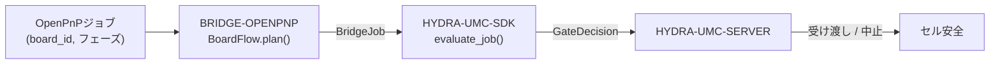

<!-- =============================================================================
HYDRA-UMC-BRIDGE-OPENPNP - OpenPnPボードフローブリッジ
Copyright (C) 2026 JuanenRac (Electro Hobby 3D) <electrohobby3d@gmail.com>
GPL-3.0-or-later - see LICENSE
============================================================================= -->

<p align="center">
  
</p>

# 🎯 HYDRA-UMC-BRIDGE-OPENPNP

<p align="center"><a href="README.md">🇺🇸 English</a> | <a href="README_spa.md">🇪🇸 Español</a> | <a href="README_fra.md">🇫🇷 Français</a> | <a href="README_ita.md">🇮🇹 Italiano</a> | <a href="README_deu.md">🇩🇪 Deutsch</a> | <a href="README_zho.md">🇨🇳 简体中文</a> | 🇯🇵 <b>日本語</b></p>

### 📋 OpenPnP向け追跡可能なボードフロー連携ブリッジ

<p align="left">
  
  
  
</p>

---

## 1. 🛠️ 技術概要

**HYDRA-UMC-BRIDGE-OPENPNP** は、HYDRA-UMCとOpenPnPとを結ぶ高レベルのボードフローブリッジである。PCB準備、ロボット搭載、ネイティブ実装、ロボット取り出し、追跡可能な完了処理を連携させる。実装キネマティクス、フィーダー制御、生の動作は実装しない —— それらは完全にOpenPnP内部にとどまる。

本リポジトリは **External Automation Bridges** ファミリーに属する。CNC・LASER・OPENPNP・PRINTER3D・ROS2という兄弟リポジトリ群が、すべて `HYDRA-UMC-SDK` の同じ安全契約を共有しており、いずれのブリッジも独自の「作業に安全」という定義を勝手に作ることはできない。

### 主な機能:
* ✅ **実在する追跡可能なボードフローコア:** `board_flow.py` の `BoardFlow.plan()` は、安全ゲートを評価する*前に*、`board_id` が空であるか先頭・末尾に空白を含むジョブをすべて拒否する —— すべての受け渡しは安定した、クリーンな識別子を持つことが求められる。*(実装済み、`tests/test_board_flow.py` でテスト済み)*
* ✅ **実在するフェーズ別受け渡しマップ:** 固定辞書が各 `JobPhase`(`PREPARE`、`LOAD`、`PROCESS`、`UNLOAD`、`COMPLETE`、`ABORT`)を明示的で読みやすい受け渡し説明にマッピングする —— `verify-board-and-fixture`、`robot-loads-board-into-pnp-fixture`、`openpnp-places-declared-job` など。*(実装済み)*
* ✅ **実在する共有安全ゲート:** 有効なジョブはすべて `HYDRA-UMC-SDK` の `bridge_contract` にある `evaluate_job()` を通じて評価される。これは他のすべての兄弟ブリッジとHYDRA-UMC-SERVERが使うのと同じゲートである。実際の受け渡しが進むのは、外部機械が `IDLE` を報告し、HYDRA-UMCセルが `READY` である場合のみである。*(実装済み)*
* ✅ **非破壊的なビルド/テスト:** `build-test.bat`/`.sh` はソースをコンパイルし、バージョンファイルやCHANGELOGに一切触れずにボード追跡性とフェイルセーフのテストスイートを実行する。*(実装済み、下記「ビルドと実行」を参照)*
* ✅ **読み取り専用のOpenPnPプロファイル検査:** `inspect_openpnp_config.py` は保存済みの `machine.xml` を解析し、`openpnp-scripts/HYDRA-UMC/inspect_profile.js` は手動で呼び出す OpenPnP メニュースクリプトのテンプレートである。両者はクラスとコンポーネント数のみを報告し、テンプレートは情報ダイアログに結果を表示する。機械コマンドは一切送信しない。*(実装・テスト済み)*
* ✅ **追跡専用の受け渡しシミュレーション:** `BoardIdentity` は `simulate_board_handoff()` が共有 SDK ゲートを適用する前に基板、レシピ、リビジョン、ロットの識別子を束ねる。許可された計画に対してのみ決定論的な SHA-256 追跡指紋を出力し、OpenPnP、シリアル、機械 I/O は一切持たない。*(実装・テスト済み)*
* ✅ **追跡専用の生産サイクルシミュレーション:** `simulate_board_cycle()` は明示的なセル/機械状態で、順序付けられた `PREPARE → LOAD → PROCESS → UNLOAD → COMPLETE` を評価する。各生産ステップは `READY/IDLE` 以外では安全に拒否され、`ABORT` は SDK の安全経路で独立したままである。*(実装・テスト済み)*
* ✅ **決定論的エビデンス契約:** `docs/HANDOFF_EVIDENCE.md` は両シミュレーターが出力するスキーマ `1.0` を定義する。フェーズ、判断、理由、許可された識別子指紋のみを含み、生の基板、レシピ、リビジョン、ロット値は JSON レコードに一切入らない。*(実装・テスト済み)*

---

## 2. 🔄 ボードフロー連携フロー



---

## 3. 🧱 アーキテクチャと設計判断

* **なぜ `board_id` の検証が `plan()` の中で他の何よりも先に行われるのか。** `BoardFlow.plan()` の最初のチェックは `not board_id or board_id.strip() != board_id` である —— 不正または曖昧なボード識別子は、下流に転送されて追跡がより困難になる前に、明示的な理由とともに即座に拒否される。
* **なぜ受け渡しは文字列フォーマットではなく `JobPhase` をキーとする固定辞書なのか。** `BoardFlow._handoffs` はサポートされる6つのフェーズそれぞれを、文字通りの曖昧さのない説明にマッピングする。未知の将来フェーズは `unrecognized-phase` として拒否され、共通SDKゲートがREADYであるだけで許可済み受け渡しになることはない。
* **なぜブリッジは外部機械が `IDLE` でセルが `READY` の場合にのみ実際の転送を計画するのか。** ボードの受け渡しは両者が関わる物理的な操作である。いずれかの側が既知の安全な状態にない場合、転送を計画することは、予測不能な機械へロボットを移動させるよう要求することになる。
* **なぜ故障中でも `ABORT` を要求できるのか。** `JobPhase.ABORT` は `request-controlled-stop` にマッピングされ、これは共有の `evaluate_job()` ゲートが実際のフェーズを阻止するのと同じようには阻止しない —— オペレーターや監督者は、故障の最中であっても常に制御された停止を要求できなければならない。
* **なぜライブOpenPnP拡張/APIは引き続き保留なのか。** 保存済みマシンプロファイルは読み取り専用で検査できるようになったが、プラグインインターフェースまたはライブ面の選択には依然として非本番テストセッションが必要である。これにより、未検証の動作やフィーダーの前提を組み込まない。
* **エコシステムの他部分とどう関係するか。** BRIDGE-OPENPNPはOpenPnPジョブと `HYDRA-UMC-SDK` → `HYDRA-UMC-SERVER` → セル安全との間に位置する。ボード受け渡しのロボット側を連携させるものであり、OpenPnP自身に属する実装キネマティクスやフィーダー制御を主張することは決してない。

---

## 📂 ディレクトリ構成

```text
HYDRA-UMC-BRIDGE-OPENPNP/
├── src/
│   └── hydra_umc_bridge_openpnp/
│       ├── __init__.py
│       ├── board_flow.py        # BoardFlow: board_id検証 + フェーズ別受け渡しゲート
│       ├── configuration.py     # マシンを開いたり変更したりせずにOpenPnPマシンXMLを検査する
│       ├── evidence.py          # ローカルのみのシミュレーションから決定論的で非機密な証拠を生成
│       ├── handoff.py           # 追跡可能なPCB受け渡しを検証/シミュレート - OpenPnPを一切importせずI/Oにも触れない
│       └── mqtt_transport.py    # 実MQTTブローカー転送 - ここには実際のマシン転送は一切存在しない
├── tests/
│   ├── test_board_flow.py       # ボード追跡性とフェイルセーフのテスト
│   └── test_mqtt_transport.py   # 疑似ブローカークライアントに対するMQTT証拠/ステータス形状テスト
├── tools/
│   ├── build_test.py            # 非破壊的なコンパイル+テストランナー (build-test.bat/.sh)
│   ├── bump_version.py          # pyproject.toml、マニフェスト、CHANGELOG.md を同期
│   ├── ci_validate.py           # 依存関係なし・非破壊のCIベースライン (.github/workflows/ci.yml が使用)
│   ├── inspect_openpnp_config.py # 保存済みOpenPnP machine.xmlの読み取り専用CLIインスペクター
│   ├── simulate_cycle.py        # 追跡専用の生産サイクルシミュレーターCLI
│   └── simulate_handoff.py      # 追跡専用の基板ハンドオフシミュレーターCLI
├── docs/
│   ├── BRIDGE_GUIDE.md          # 適用範囲、対応プラットフォーム、スクリプト、ハードウェア受け入れゲート
│   └── HANDOFF_EVIDENCE.md      # 何が実際の受け渡し証拠とみなされ、このbridgeが何を推測しないか
├── images/
│   └── HYDRA_UMC_BANNER.svg     # README バナー
├── build-test.bat / build-test.sh  # 検証のみ、リポジトリを一切変更しない
├── build.bat / build.sh            # 検証後、成功時のみバージョン + CHANGELOG を更新
├── pyproject.toml               # パッケージメタデータ。HYDRA-UMC-SDK に依存 (git)
├── hydra-umc.project.json       # エコシステムマニフェスト(バージョン、成熟度、ファミリー)
├── CHANGELOG.md
├── CODE_OF_CONDUCT.md / CONTRIBUTING.md / SECURITY.md / SUPPORT.md
├── LICENSE / LICENSE.md
└── README.md / README_*.md      # 本ファイルおよびその6言語訳
```

---

## 4. ⚙️ ビルドと実行

Python 3.11以上が必要。`tools/build_test.py` は `HYDRA-UMC-SDK` が兄弟ディレクトリ(`../HYDRA-UMC-SDK`)としてチェックアウトされているか、環境変数 `HYDRA_UMC_SDK_ROOT` で指定されていることを期待する。

```bash
# Windows
build-test.bat      # 検証のみ —— バージョン/CHANGELOGの変更なし
build.bat            # 検証後、成功時にバージョン + CHANGELOG を更新

# Linux/macOS
bash build-test.sh
bash build.sh
```

`build-test` は `src/` 配下の各モジュールを `py_compile` でコンパイルし、`unittest` の全スイート(`tests/test_board_flow.py`)を実行して、ボード追跡性による拒否とフェイルセーフゲートを実証する —— リポジトリを一切変更しない。`build` はまず同じ検証を実行し、成功した場合のみ `tools/bump_version.py` を呼び出して `pyproject.toml`、`hydra-umc.project.json`、`CHANGELOG.md` の間でバージョンを同期する。実際の機械向け `run` コマンドはまだ存在しない —— それには検証済みのOpenPnP統合が必要である。

---

## ✅ 現状と次のステップ

**現時点で実在するもの:** バージョン `0.1.1`。ローカルでテスト済みの追跡可能なPCB受け渡しコア(`BoardFlow`)が `HYDRA-UMC-SDK` の共有ジョブゲートの上に構築されており、28件の決定論的な `unittest` スイート、ヘッド/カメラ/ドライバー/フィーダーの数とともに実際の OpenPnP アクチュエータ/シグナラー/ノズルチップの証拠を報告する保存済みプロファイル検査器、可視の手動読み取り専用 OpenPnP メニューテンプレート、識別子結合の受け渡し/サイクルシミュレーション、機械 I/O のない CI 検証済み非機密 JSON エビデンス契約を備える。

**統合境界:** OpenPnPは常に実装キネマティクス、フィーダー制御、生の動作を保持する。このブリッジがゲート・追跡するのはあくまでその周りの*受け渡し*のみである —— ロボットによる搭載、ネイティブ実装の完了、ロボットによる取り出し。

**今後の課題:** OpenPnPマシンへのライブ接続は主張されていない —— 具体的な拡張/APIは、オペレーター同席の隔離された非本番セッションでのみ選定される。

---

## 🔗 関連プロジェクト

本プロジェクトは、同じ作者(JuanenRac / Electro Hobby 3D)による HYDRA-UMC ロボティクスエコシステムの一部です。リクエストが実はこの中のどれかについてのものである可能性があるため、知っておく価値があります。

**親プロジェクト**
- **[HYDRA-UMC-SERVER](https://github.com/JuanenRac/HYDRA-UMC-SERVER)** — すべての制御クライアントが実際に通信する、本物のヘッドレスバックエンド(REST/WebSocket)。各コマンドがこのブリッジ自身のローカル安全ゲートを通過した後、本ブリッジが報告する認証済みエコシステム境界。

**兄弟プロジェクト** —— それぞれ独自のクライアントとして、同じく HYDRA-UMC-SERVER 自身の API と通信する
- **[HYDRA-UMC-STUDIO](https://github.com/JuanenRac/HYDRA-UMC-STUDIO)** — リアルタイムのマルチロボット 3D 可視化を備えたウェブ制御ダッシュボード。
- **[HYDRA-UMC-SUITE](https://github.com/JuanenRac/HYDRA-UMC-SUITE)** — 複数のサーバーを同時に扱えるデスクトップ(PySide6)スウォームコマンドセンター、スタンドアロン実行ファイルとしてパッケージ化。
- **[HYDRA-UMC-ANDROID-CONTROL](https://github.com/JuanenRac/HYDRA-UMC-ANDROID-CONTROL)** — 生体認証ログインとペアリングされた Wear OS コンパニオンを備えたネイティブ Android 制御アプリ。
- **[HYDRA-UMC-IOS-CONTROL](https://github.com/JuanenRac/HYDRA-UMC-IOS-CONTROL)** — リアルタイム WebSocket 同期を備えた iOS/iPadOS 制御アプリ(Flutter)。
- **[HYDRA-UMC-DSI](https://github.com/JuanenRac/HYDRA-UMC-DSI)** — 本体搭載の 7 インチ DSI タッチスクリーン向けネイティブタッチ UI、CM5 自体に組み込み。
- **[HYDRA-UMC-BRIDGE-AMR](https://github.com/JuanenRac/HYDRA-UMC-BRIDGE-AMR)** — 実際の VDA 5050 MQTT パブリッシャーによる AGV/AMR フリートの調整境界。
- **[HYDRA-UMC-BRIDGE-CNC](https://github.com/JuanenRac/HYDRA-UMC-BRIDGE-CNC)** — 実際の GRBL ステータス/制御バイトへのアクセスを持つ、CNC セルの高レベルコーディネーター。
- **[HYDRA-UMC-BRIDGE-DROIDS](https://github.com/JuanenRac/HYDRA-UMC-BRIDGE-DROIDS)** — 実際の Boston Dynamics Spot コマンド送信機能を持つ、脚型/ヒューマノイドドロイドの調整境界。
- **[HYDRA-UMC-BRIDGE-LASER](https://github.com/JuanenRac/HYDRA-UMC-BRIDGE-LASER)** — 実際のキー/筐体/インターロック GPIO セーフガード 3 系統を読み取る、レーザーセルの安全コーディネーター。
- **[HYDRA-UMC-BRIDGE-PRINTER3D](https://github.com/JuanenRac/HYDRA-UMC-BRIDGE-PRINTER3D)** — 実際にゲート制御されたジョブコマンドを持つ、Moonraker/Klipper 3D プリンター向けの安全な調整境界。
- **[HYDRA-UMC-BRIDGE-ROS2](https://github.com/JuanenRac/HYDRA-UMC-BRIDGE-ROS2)** — 実際の遅延インポート rclpy ROS 2 トランスポートを持つ安全コーディネーター。
- **[HYDRA-UMC-BRIDGE-UAV](https://github.com/JuanenRac/HYDRA-UMC-BRIDGE-UAV)** — 実際の MAVLink コマンド送信機能を持つ、カメラ搭載 UAV の調整境界。

**直接関連**
- **[HYDRA-UMC-SDK](https://github.com/JuanenRac/HYDRA-UMC-SDK)** — すべてのブリッジが自身のコマンドを検証する共有 JSON-Schema 契約と安全ゲートの境界。
- **[HYDRA-UMC-MQTT-BROKER](https://github.com/JuanenRac/HYDRA-UMC-MQTT-BROKER)** — このブリッジ自身の `hydra/bridges/openpnp/...` トピック向けの `mqtt_transport.py` の実際のトランスポート——ジョブゲートと完全に追跡可能な引き渡しシミュレーション。ここには観測すべき実際のマシントランスポートが存在しないため `state` トピックはない。詳細はそのリポジトリ自身の `docs/BRIDGE_TOPICS.md` を参照。
- **[HYDRA-UMC-SAFETY-ZONES](https://github.com/JuanenRac/HYDRA-UMC-SAFETY-ZONES)** — 本ブリッジ向けの将来のセルゾーン安全実証。

**エコシステムの他のプロジェクト**

*コアハードウェア&プラットフォーム*
- **[HYDRA-UMC](https://github.com/JuanenRac/HYDRA-UMC)** — 実際のロボットアームのマザーボード——CM5 ホスト + デュアルコア STM32H745、CAN-OTA/SPI-OTA 経由で最大 8 本のツールアームを統括。
- **[HYDRA-UMC-OS](https://github.com/JuanenRac/HYDRA-UMC-OS)** — CM5 向けの再現可能な Raspberry Pi OS プロダクト層——読み取り専用エージェント、検証済み設定/プロファイル、WiFi 初回接続プロビジョニング。

*コアバックエンド&クライアント*
- **[HYDRA-UMC-EDITOR-URDF](https://github.com/JuanenRac/HYDRA-UMC-EDITOR-URDF)** — 完成したモデルを STUDIO 自身のカタログへ送信するデスクトップ用グラフィカル URDF 作成/編集ツール。

*URTC ツールプラットフォーム*
- **[URTC](https://github.com/JuanenRac/URTC)** — 物理的な Universal Robot Tool Controller 基板向けファームウェア、CAN バス経由の 25 以上のツールプロファイル。
- **[URTC-FLASHER](https://github.com/JuanenRac/URTC-FLASHER)** — URTC 基板用のデスクトップ GUI 書き込みツール、CAN-OTA およびフルチップ SWD/JTAG。
- **[URTC-TESTER](https://github.com/JuanenRac/URTC-TESTER)** — URTC 基板向けのデスクトップ CAN バスライブ診断ツール、ツールプロファイルごとに 1 パネル。
- **[URTC-WEB-STUDIO](https://github.com/JuanenRac/URTC-WEB-STUDIO)** — Web Serial API を使ったブラウザベースの URTC-TESTER の代替、ローカルインストール不要。

*ビジョン AI ノード(Hailo-8)*
- **[HYDRA-UMC-VISION-NODE](https://github.com/JuanenRac/HYDRA-UMC-VISION-NODE)** — Hailo-8 ビジョンパイプラインの統合ハブ、段階ごとの実際のハードウェア準備状況チェック付き。
- **[HYDRA-UMC-DETECTION-HEF](https://github.com/JuanenRac/HYDRA-UMC-DETECTION-HEF)** — Hailo アーキテクチャ/チェックサムによる安全読み込み検証を備えた、実際のコンパイル済みモデルレジストリ。
- **[HYDRA-UMC-VISION-STREAMER](https://github.com/JuanenRac/HYDRA-UMC-VISION-STREAMER)** — 実際の HailoRT 統合境界を持つ、実際の GStreamer パイプライン + MediaMTX 設定生成器。
- **[HYDRA-UMC-VISUAL-SERVOING-API](https://github.com/JuanenRac/HYDRA-UMC-VISUAL-SERVOING-API)** — 上流のゾーン状態に応じて安全ゲート制御される、実際の Position-Based Visual Servoing 補正則。

*コグニティブ AI ノード(Hailo-10)*
- **[HYDRA-UMC-COGNITIVE-NODE](https://github.com/JuanenRac/HYDRA-UMC-COGNITIVE-NODE)** — Hailo-10 コグニティブパイプライン(LLM/VLA/音声オーケストレーション)の統合ハブ。
- **[HYDRA-UMC-VLA-ENGINE](https://github.com/JuanenRac/HYDRA-UMC-VLA-ENGINE)** — Vision-Language-Action モデル向けの、実際のアクショントークンのエンコード/デコードと軌道生成。
- **[HYDRA-UMC-VOICE-UI](https://github.com/JuanenRac/HYDRA-UMC-VOICE-UI)** — 確認ゲート付きの限定的な Watch リレーを備えた、実際の音声フロントエンド(VAD + 意図解析)。
- **[HYDRA-UMC-SEMANTIC-PLANNER](https://github.com/JuanenRac/HYDRA-UMC-SEMANTIC-PLANNER)** — MCU エラーコードに対する、実際のルールベースのタスク分解と意味的エラー復旧。
- **[HYDRA-UMC-DOCS-QA](https://github.com/JuanenRac/HYDRA-UMC-DOCS-QA)** — このエコシステム自身の Markdown ドキュメントに対する、標準ライブラリのみの実際の TF-IDF 文書検索。

*オーケストレーション&スウォーム*
- **[HYDRA-UMC-ORCHESTRATOR](https://github.com/JuanenRac/HYDRA-UMC-ORCHESTRATOR)** — 実際の gRPC/Protobuf ヘルスレポート契約とミッションステートマシンを持つ統合ハブ。
- **[HYDRA-UMC-JOB-DISPATCHER](https://github.com/JuanenRac/HYDRA-UMC-JOB-DISPATCHER)** — 実際の HTTP API 上に構築された、優先度ベースの実際のジョブキュー(重複排除付き)。
- **[HYDRA-UMC-NODE-HEALING](https://github.com/JuanenRac/HYDRA-UMC-NODE-HEALING)** — リトライ/バックオフとアイデンティティ不一致検出を備えた、実際の gRPC ベースのフリートヘルスウォッチドッグ。
- **[HYDRA-UMC-PATH-PLANNER-3D](https://github.com/JuanenRac/HYDRA-UMC-PATH-PLANNER-3D)** — 実際の障害物/ワークスペース衝突検証を備えた、実際の RRT ベースの 3D 経路プランナー。
- **[HYDRA-UMC-SWARM-SYNC](https://github.com/JuanenRac/HYDRA-UMC-SWARM-SYNC)** — 複数セルの収束についてプロパティテストされた、実際の CRDT LWW-Element-Map 状態同期。

*デジタルツイン&シミュレーション*
- **[HYDRA-UMC-TWIN](https://github.com/JuanenRac/HYDRA-UMC-TWIN)** — 実際のバージョン互換性同期契約を持つ、デジタルツインエンジンの統合ハブ。
- **[HYDRA-UMC-HIL-BRIDGE](https://github.com/JuanenRac/HYDRA-UMC-HIL-BRIDGE)** — シミュレーションと実際のハードウェアの間でコマンドをルーティングする、実際のハードウェア・イン・ザ・ループ安全インターロック。
- **[HYDRA-UMC-PHYSICS-REPLICA](https://github.com/JuanenRac/HYDRA-UMC-PHYSICS-REPLICA)** — 実際の URDF サブセットに対する、実際の順運動学と関節限界検証。
- **[HYDRA-UMC-SYNTHETIC-DATA-GEN](https://github.com/JuanenRac/HYDRA-UMC-SYNTHETIC-DATA-GEN)** — YOLO/COCO アノテーションのエクスポート機能を持つ、実際のプロシージャル 2D シーンジェネレーター。

*データ&分析*
- **[HYDRA-UMC-DATALAKE](https://github.com/JuanenRac/HYDRA-UMC-DATALAKE)** — 実際の取り込み/クエリ HTTP API を備えた、実際の sqlite3 ベースの時系列ストア。
- **[HYDRA-UMC-ANOMALY-DETECTOR](https://github.com/JuanenRac/HYDRA-UMC-ANOMALY-DETECTOR)** — ドリフト監視を備えた、実際の FFT + 統計ベースラインによる異常検知器。
- **[HYDRA-UMC-PRODUCTION-REPORTS](https://github.com/JuanenRac/HYDRA-UMC-PRODUCTION-REPORTS)** — DATALAKE の履歴に対する実際の OEE/稼働率計算、再現可能な CSV エクスポート付き。
- **[HYDRA-UMC-TELEMETRY-COLLECTOR](https://github.com/JuanenRac/HYDRA-UMC-TELEMETRY-COLLECTOR)** — シーケンス重複排除機能を備えた、DATALAKE への実際の CAN/WebSocket 取り込みパイプライン。

*産業用ゲートウェイ*
- **[HYDRA-UMC-GATEWAY-INDUSTRIAL](https://github.com/JuanenRac/HYDRA-UMC-GATEWAY-INDUSTRIAL)** — 実際のコマンド許可リスト/バックプレッシャー層を持つ、産業用プロトコルへ中継する統合ハブ。
- **[HYDRA-UMC-OPCUA-SERVER](https://github.com/JuanenRac/HYDRA-UMC-OPCUA-SERVER)** — 実際のバイナリプロトコルクライアントセッションで検証された、実際の OPC-UA アドレス空間。
- **[HYDRA-UMC-MTCONNECT-ADAPTER](https://github.com/JuanenRac/HYDRA-UMC-MTCONNECT-ADAPTER)** — 縮退モード出力を備えた、実際の MTConnect `/probe` および `/current` XML エンドポイント。

*補完ツール&エコシステム運用*
- **[HYDRA-UMC-DASHBOARD-AI](https://github.com/JuanenRac/HYDRA-UMC-DASHBOARD-AI)** — 誠実な統計フォールバックを備えた、DATALAKE/ANOMALY-DETECTOR 上のスマートサマリーと異常ハイライトパネル。
- **[HYDRA-UMC-TOOL-CLI](https://github.com/JuanenRac/HYDRA-UMC-TOOL-CLI)** — 実際の安定した終了コード契約を持つフリート CLI、HYDRA-UMC-SERVER 自身の API の本物のライブクライアント。
- **[HYDRA-UMC-WATCH](https://github.com/JuanenRac/HYDRA-UMC-WATCH)** — 実際の触覚アラートとペアリングされたスマートフォンへの音声リレーを備えた WearOS コンパニオンアプリ。
- **[URTC-SMART-RACK](https://github.com/JuanenRac/URTC-SMART-RACK)** — 実際の工具 ID デコードと Smart Idle 予熱ロジックを備えた、基板搭載ラック用ファームウェア。
- **[URTC-VISION-TOOL](https://github.com/JuanenRac/URTC-VISION-TOOL)** — サーマル/RGB 検査ツールヘッド向けの、ファームウェアと実際の Python ビジョンコンパニオン。
- **[HYDRA-UMC-UPDATER](https://github.com/JuanenRac/HYDRA-UMC-UPDATER)** — このエコシステム内のすべてのリポジトリを検出・クローン・更新する、管理用デスクトップツール。

## 👤 作者
**JuanenRac** (Electro Hobby 3D)
📧 electrohobby3d@gmail.com
📺 [youtube.com/@electrohobby3d](https://youtube.com/@electrohobby3d)

## 📜 ライセンス
GPL-3.0 - 詳細はLICENSEを参照。
