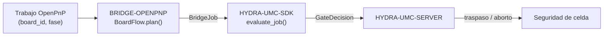

<!-- =============================================================================
HYDRA-UMC-BRIDGE-OPENPNP - Puente de flujo de placas para OpenPnP
Copyright (C) 2026 JuanenRac (Electro Hobby 3D) <electrohobby3d@gmail.com>
GPL-3.0-or-later - see LICENSE
============================================================================= -->

<p align="center">
  
</p>

# 🎯 HYDRA-UMC-BRIDGE-OPENPNP

<p align="center"><a href="README.md">🇺🇸 English</a> | 🇪🇸 <b>Español</b> | <a href="README_fra.md">🇫🇷 Français</a> | <a href="README_ita.md">🇮🇹 Italiano</a> | <a href="README_deu.md">🇩🇪 Deutsch</a> | <a href="README_zho.md">🇨🇳 简体中文</a> | <a href="README_jpn.md">🇯🇵 日本語</a></p>

### 📋 Puente de coordinación trazable de flujo de placas para OpenPnP

<p align="left">
  
  
  
</p>

---

## 1. 🛠️ VISIÓN TÉCNICA GENERAL

**HYDRA-UMC-BRIDGE-OPENPNP** es el puente de alto nivel de flujo de placas entre HYDRA-UMC y OpenPnP. Coordina la preparación de PCB, la carga por robot, la colocación nativa, la descarga por robot y la finalización trazable. No implementa cinemática de colocación, control de alimentadores ni movimiento en bruto: eso permanece enteramente dentro de OpenPnP.

Pertenece a la familia **External Automation Bridges**: un conjunto de repositorios hermanos (CNC, LASER, OPENPNP, PRINTER3D, ROS2) que hablan el mismo contrato de seguridad compartido de `HYDRA-UMC-SDK`, de modo que ningún puente puede inventar su propia definición de "seguro para trabajar".

### Características clave:
* ✅ **Núcleo trazable de flujo de placas, real:** `board_flow.py` — `BoardFlow.plan()` rechaza cualquier trabajo cuyo `board_id` esté vacío o tenga espacios al inicio/final *antes* incluso de evaluar la puerta de seguridad; cada traspaso debe llevar un identificador estable y limpio. *(implementado, probado en `tests/test_board_flow.py`)*
* ✅ **Mapa de traspaso por fase, real:** un diccionario fijo mapea cada `JobPhase` (`PREPARE`, `LOAD`, `PROCESS`, `UNLOAD`, `COMPLETE`, `ABORT`) a una descripción explícita y legible del traspaso — `verify-board-and-fixture`, `robot-loads-board-into-pnp-fixture`, `openpnp-places-declared-job`, etc. *(implementado)*
* ✅ **Puerta de seguridad compartida, real:** cada trabajo válido se evalúa mediante `evaluate_job()` de `bridge_contract` en `HYDRA-UMC-SDK`, la misma puerta que usan todos los puentes hermanos y HYDRA-UMC-SERVER; un traspaso productivo solo avanza cuando la máquina externa reporta `IDLE` y la celda HYDRA-UMC está `READY`. *(implementado)*
* ✅ **Compilación/prueba no mutante:** `build-test.bat`/`.sh` compilan el código y ejecutan la batería de pruebas de trazabilidad de placas y seguridad sin tocar archivos de versión ni el CHANGELOG. *(implementado, ver COMPILACIÓN Y EJECUCIÓN más abajo)*
* ✅ **Inspección de perfil OpenPnP de solo lectura:** `inspect_openpnp_config.py` analiza un `machine.xml` guardado, mientras `openpnp-scripts/HYDRA-UMC/inspect_profile.js` es una plantilla de script de menú de OpenPnP que se invoca manualmente; ambos informan solo de clase y recuentos de componentes, y la plantilla muestra ese resultado en un diálogo informativo sin enviar órdenes a la máquina. *(implementado, probado)*
* ✅ **Simulación de traspaso solo trazable:** `BoardIdentity` vincula identificadores de placa, receta, revisión y lote antes de que `simulate_board_handoff()` aplique la puerta compartida del SDK; emite una huella SHA-256 determinista solo para un plan permitido y no tiene E/S de OpenPnP, serie ni máquina. *(implementado, probado)*
* ✅ **Simulación de ciclo productivo solo trazable:** `simulate_board_cycle()` evalúa la secuencia ordenada `PREPARE → LOAD → PROCESS → UNLOAD → COMPLETE` bajo un estado explícito de célula/máquina; cada paso productivo falla cerrado fuera de `READY/IDLE`, y `ABORT` permanece separado en la ruta de seguridad del SDK. *(implementado, probado)*
* ✅ **Contrato de evidencia determinista:** `docs/HANDOFF_EVIDENCE.md` define el esquema `1.0` que emiten ambos simuladores. Solo contiene fase, decisión, motivo y una huella de identidad permitida; los valores de placa, receta, revisión y lote nunca entran en el registro JSON. *(implementado, probado)*

---

## 2. 🔄 FLUJO DE COORDINACIÓN DE PLACAS



---

## 3. 🧱 ARQUITECTURA Y DECISIONES DE DISEÑO

* **Por qué la validación de `board_id` ocurre antes que cualquier otra cosa en `plan()`.** La primera comprobación de `BoardFlow.plan()` es `not board_id or board_id.strip() != board_id`: un identificador de placa malformado o ambiguo se rechaza de inmediato, con una razón explícita, en lugar de reenviarse aguas abajo donde sería más difícil de trazar.
* **Por qué los traspasos son un diccionario fijo indexado por `JobPhase`, no formateo de cadenas.** `BoardFlow._handoffs` mapea cada una de las seis fases admitidas a una descripción literal e inequívoca. Una fase futura desconocida se rechaza como `unrecognized-phase`; no puede convertirse en un traspaso permitido solo porque la puerta común del SDK esté preparada.
* **Por qué el puente solo planifica un traspaso productivo cuando la máquina externa está `IDLE` y la celda está `READY`.** El traspaso de placas es una operación física de dos partes; si cualquiera de los dos lados no está en un estado conocido y seguro, planificar un traspaso significaría pedirle a un robot que se mueva hacia una máquina impredecible.
* **Por qué `ABORT` sigue siendo solicitable durante un fallo.** `JobPhase.ABORT` se mapea a `request-controlled-stop`, algo que la puerta compartida `evaluate_job()` no bloquea de la misma forma que bloquea las fases productivas — un operador o supervisor siempre debe poder pedir una parada controlada, incluso en mitad de un fallo.
* **Por qué la extensión/API viva de OpenPnP sigue aplazada.** El perfil guardado de máquina ya puede inspeccionarse en solo lectura, pero elegir una interfaz de plugin o superficie viva aún requiere una sesión de pruebas no productiva; así se evita incorporar suposiciones no verificadas de movimiento o alimentadores.
* **Cómo encaja en el resto del ecosistema.** BRIDGE-OPENPNP se sitúa entre un trabajo de OpenPnP y `HYDRA-UMC-SDK` → `HYDRA-UMC-SERVER` → seguridad de celda: coordina el lado robótico de un traspaso de placas, nunca reclama la cinemática de colocación ni el control de alimentadores que pertenecen a OpenPnP.

---

## 📂 ESTRUCTURA DE DIRECTORIOS

```text
HYDRA-UMC-BRIDGE-OPENPNP/
├── src/
│   └── hydra_umc_bridge_openpnp/
│       ├── __init__.py
│       ├── board_flow.py        # BoardFlow: validación de board_id + puerta de traspaso por fase
│       ├── configuration.py     # Inspecciona un XML de máquina OpenPnP sin abrir ni modificar ninguna máquina
│       ├── evidence.py          # Evidencia determinista y no sensible a partir de simulaciones solo locales
│       ├── handoff.py           # Valida/simula un traspaso de PCB trazable - nunca importa OpenPnP ni toca E/S
│       └── mqtt_transport.py    # Transporte MQTT real - aquí no existe ningún transporte de máquina real
├── tests/
│   ├── test_board_flow.py       # Pruebas de trazabilidad de placas y seguridad
│   └── test_mqtt_transport.py   # Tests de forma de evidencia/estado MQTT contra un cliente de broker simulado
├── tools/
│   ├── build_test.py            # Compilador + ejecutor de pruebas no mutante (build-test.bat/.sh)
│   ├── bump_version.py          # Sincroniza pyproject.toml, manifiesto y CHANGELOG.md
│   ├── ci_validate.py           # Línea base de CI sin dependencias y no destructiva (usada por .github/workflows/ci.yml)
│   ├── inspect_openpnp_config.py # Inspector CLI de solo lectura para un machine.xml de OpenPnP guardado
│   ├── simulate_cycle.py        # CLI del simulador de ciclo productivo solo de trazabilidad
│   └── simulate_handoff.py      # CLI del simulador de traspaso de placa solo de trazabilidad
├── docs/
│   ├── BRIDGE_GUIDE.md          # Alcance, plataformas compatibles, scripts, puerta de aceptación de hardware
│   └── HANDOFF_EVIDENCE.md      # Qué cuenta como evidencia de traspaso real y qué se niega a inferir este bridge
├── images/
│   └── HYDRA_UMC_BANNER.svg     # Banner del README
├── build-test.bat / build-test.sh  # Solo valida, nunca modifica el repositorio
├── build.bat / build.sh            # Valida y, solo si tiene éxito, sube versión + CHANGELOG
├── pyproject.toml               # Metadatos del paquete; depende de HYDRA-UMC-SDK (git)
├── hydra-umc.project.json       # Manifiesto del ecosistema (versión, madurez, familia)
├── CHANGELOG.md
├── CODE_OF_CONDUCT.md / CONTRIBUTING.md / SECURITY.md / SUPPORT.md
├── LICENSE / LICENSE.md
└── README.md / README_*.md      # Este archivo y sus 6 traducciones
```

---

## 4. ⚙️ COMPILACIÓN Y EJECUCIÓN

Requiere Python 3.11+. `tools/build_test.py` espera que `HYDRA-UMC-SDK` esté clonado como directorio hermano (`../HYDRA-UMC-SDK`) o indicado mediante la variable de entorno `HYDRA_UMC_SDK_ROOT`.

```bash
# Windows
build-test.bat      # solo valida — sin cambio de versión/CHANGELOG
build.bat            # valida y, si tiene éxito, sube versión + CHANGELOG

# Linux/macOS
bash build-test.sh
bash build.sh
```

`build-test` compila cada módulo bajo `src/` con `py_compile` y ejecuta la batería completa de `unittest` (`tests/test_board_flow.py`), demostrando el rechazo por trazabilidad de placas y la puerta de seguridad — nunca modifica el repositorio. `build` ejecuta primero esa misma validación y, solo si tiene éxito, llama a `tools/bump_version.py` para sincronizar la versión en `pyproject.toml`, `hydra-umc.project.json` y `CHANGELOG.md`. Todavía no existe un comando `run` real de máquina — eso requiere una integración de OpenPnP validada.

---

## ✅ ESTADO ACTUAL Y PRÓXIMOS PASOS

**Real hoy:** versión `0.1.1`, un núcleo trazable de traspaso de PCB probado en local (`BoardFlow`) apoyado en la puerta de trabajo compartida de `HYDRA-UMC-SDK`, una batería `unittest` determinista de veintiocho pruebas, un inspector de perfil guardado que reporta evidencia real de actuadores/señalizadores/puntas de boquilla de OpenPnP junto con los recuentos de cabezales/cámaras/drivers/alimentadores, una plantilla visible de menú OpenPnP de solo lectura, simulaciones de traspaso/ciclo vinculadas a identidad y un contrato JSON de evidencia no sensible verificado por CI sin E/S de máquina.

**Frontera de integración:** OpenPnP conserva en todo momento la cinemática de colocación, el control de alimentadores y el movimiento en bruto; este puente solo controla y traza el *traspaso* alrededor de ello — carga por robot, finalización de la colocación nativa, descarga por robot.

**Todavía pendiente:** no se afirma ninguna conexión viva con una máquina OpenPnP — la extensión/API concreta se elegirá solo en una sesión aislada no productiva con un operador presente.

---

## 🔗 Proyectos Relacionados

Este proyecto es parte del ecosistema de robótica HYDRA-UMC del mismo autor (JuanenRac / Electro Hobby 3D). Vale la pena conocerlo, ya que una petición podría en realidad ser sobre alguno de estos en vez de sobre este repositorio.

**Proyecto Padre**
- **[HYDRA-UMC-SERVER](https://github.com/JuanenRac/HYDRA-UMC-SERVER)** — el backend headless real (REST/WebSocket) con el que habla de verdad cada cliente de control; la frontera autenticada del ecosistema a la que reporta este bridge una vez cada comando ha superado la barrera de seguridad local de este propio bridge.

**Proyectos Hermanos** — también hablan con la propia API de HYDRA-UMC-SERVER, cada uno como su propio cliente
- **[HYDRA-UMC-STUDIO](https://github.com/JuanenRac/HYDRA-UMC-STUDIO)** — panel de control web con visualización 3D multi-robot en tiempo real.
- **[HYDRA-UMC-SUITE](https://github.com/JuanenRac/HYDRA-UMC-SUITE)** — centro de mando de enjambre de escritorio (PySide6) para varios servidores a la vez, empaquetado como ejecutable independiente.
- **[HYDRA-UMC-ANDROID-CONTROL](https://github.com/JuanenRac/HYDRA-UMC-ANDROID-CONTROL)** — app nativa de control para Android con inicio de sesión biométrico y un compañero Wear OS emparejado.
- **[HYDRA-UMC-IOS-CONTROL](https://github.com/JuanenRac/HYDRA-UMC-IOS-CONTROL)** — app de control para iOS/iPadOS (Flutter) con sincronización en tiempo real por WebSocket.
- **[HYDRA-UMC-DSI](https://github.com/JuanenRac/HYDRA-UMC-DSI)** — interfaz táctil nativa para la pantalla táctil DSI de 7" a bordo, embebida en el propio CM5.
- **[HYDRA-UMC-BRIDGE-AMR](https://github.com/JuanenRac/HYDRA-UMC-BRIDGE-AMR)** — barrera de coordinación para flotas AGV/AMR mediante un publicador MQTT VDA 5050 real.
- **[HYDRA-UMC-BRIDGE-CNC](https://github.com/JuanenRac/HYDRA-UMC-BRIDGE-CNC)** — coordinador de alto nivel para celdas CNC con acceso real a estado/bytes de control GRBL.
- **[HYDRA-UMC-BRIDGE-DROIDS](https://github.com/JuanenRac/HYDRA-UMC-BRIDGE-DROIDS)** — barrera de coordinación para droides con patas/humanoides, con un emisor de comandos real para Boston Dynamics Spot.
- **[HYDRA-UMC-BRIDGE-LASER](https://github.com/JuanenRac/HYDRA-UMC-BRIDGE-LASER)** — coordinador de seguridad para celdas láser que lee 3 salvaguardas GPIO reales de llave/carcasa/enclavamiento.
- **[HYDRA-UMC-BRIDGE-PRINTER3D](https://github.com/JuanenRac/HYDRA-UMC-BRIDGE-PRINTER3D)** — barrera de coordinación segura para impresoras 3D Moonraker/Klipper, con comandos de trabajo reales y controlados.
- **[HYDRA-UMC-BRIDGE-ROS2](https://github.com/JuanenRac/HYDRA-UMC-BRIDGE-ROS2)** — coordinador de seguridad con un transporte ROS 2 rclpy real, importado de forma perezosa.
- **[HYDRA-UMC-BRIDGE-UAV](https://github.com/JuanenRac/HYDRA-UMC-BRIDGE-UAV)** — barrera de coordinación para UAV equipados con cámara, con un emisor de comandos MAVLink real.

**Directamente Relacionados**
- **[HYDRA-UMC-SDK](https://github.com/JuanenRac/HYDRA-UMC-SDK)** — el contrato JSON-Schema compartido y la barrera de seguridad contra la que cada bridge valida sus comandos.
- **[HYDRA-UMC-MQTT-BROKER](https://github.com/JuanenRac/HYDRA-UMC-MQTT-BROKER)** — el transporte real de `mqtt_transport.py` para los propios tópicos `hydra/bridges/openpnp/...` de este bridge — la barrera de trabajos y una simulación de traspaso completamente trazable, sin tópico `state` porque aquí no hay un transporte de máquina real que observar; ver el propio `docs/BRIDGE_TOPICS.md` de ese repositorio.
- **[HYDRA-UMC-SAFETY-ZONES](https://github.com/JuanenRac/HYDRA-UMC-SAFETY-ZONES)** — futura evidencia de seguridad de zona de celda para este bridge.

**También Forma Parte del Ecosistema**

*Hardware y Plataforma Base*
- **[HYDRA-UMC](https://github.com/JuanenRac/HYDRA-UMC)** — la placa madre física del brazo robótico: host CM5 + coprocesador STM32H745 de doble núcleo, coordinando hasta 8 brazos herramienta por CAN-OTA/SPI-OTA.
- **[HYDRA-UMC-OS](https://github.com/JuanenRac/HYDRA-UMC-OS)** — capa de producto reproducible sobre Raspberry Pi OS para el CM5: agente de solo lectura, config/perfiles validados, aprovisionamiento WiFi de primer contacto.

*Backend Central y Clientes*
- **[HYDRA-UMC-EDITOR-URDF](https://github.com/JuanenRac/HYDRA-UMC-EDITOR-URDF)** — creador/editor gráfico de URDF de escritorio que envía los modelos terminados al propio catálogo de STUDIO.

*Plataforma de Herramientas URTC*
- **[URTC](https://github.com/JuanenRac/URTC)** — firmware para la placa física del Universal Robot Tool Controller, más de 25 perfiles de herramienta por bus CAN.
- **[URTC-FLASHER](https://github.com/JuanenRac/URTC-FLASHER)** — herramienta de escritorio con GUI para flashear placas URTC, CAN-OTA más SWD/JTAG de chip completo.
- **[URTC-TESTER](https://github.com/JuanenRac/URTC-TESTER)** — herramienta de escritorio de diagnóstico CAN-bus en vivo para placas URTC, un panel por perfil de herramienta.
- **[URTC-WEB-STUDIO](https://github.com/JuanenRac/URTC-WEB-STUDIO)** — alternativa basada en navegador a URTC-TESTER mediante la Web Serial API, sin instalación local.

*Nodo IA de Visión (Hailo-8)*
- **[HYDRA-UMC-VISION-NODE](https://github.com/JuanenRac/HYDRA-UMC-VISION-NODE)** — nodo de integración para el pipeline de visión Hailo-8, con una comprobación real de disponibilidad de hardware por etapa.
- **[HYDRA-UMC-DETECTION-HEF](https://github.com/JuanenRac/HYDRA-UMC-DETECTION-HEF)** — registro real de modelos compilados con verificación de carga segura por arquitectura Hailo/checksum.
- **[HYDRA-UMC-VISION-STREAMER](https://github.com/JuanenRac/HYDRA-UMC-VISION-STREAMER)** — generador real de pipeline GStreamer + config MediaMTX, con una frontera de integración HailoRT real.
- **[HYDRA-UMC-VISUAL-SERVOING-API](https://github.com/JuanenRac/HYDRA-UMC-VISUAL-SERVOING-API)** — ley de corrección real de Position-Based Visual Servoing, con puerta de seguridad según el estado de zona previo.

*Nodo IA Cognitivo (Hailo-10)*
- **[HYDRA-UMC-COGNITIVE-NODE](https://github.com/JuanenRac/HYDRA-UMC-COGNITIVE-NODE)** — nodo de integración para el pipeline cognitivo Hailo-10 (orquestación de LLM/VLA/voz).
- **[HYDRA-UMC-VLA-ENGINE](https://github.com/JuanenRac/HYDRA-UMC-VLA-ENGINE)** — codificación/decodificación real de tokens de acción y generación de trayectoria para un modelo Vision-Language-Action.
- **[HYDRA-UMC-VOICE-UI](https://github.com/JuanenRac/HYDRA-UMC-VOICE-UI)** — front-end de voz real (VAD + analizador de intención) con un relé a Watch acotado y con confirmación.
- **[HYDRA-UMC-SEMANTIC-PLANNER](https://github.com/JuanenRac/HYDRA-UMC-SEMANTIC-PLANNER)** — descomposición real de tareas basada en reglas y recuperación semántica de errores sobre códigos de error del MCU.
- **[HYDRA-UMC-DOCS-QA](https://github.com/JuanenRac/HYDRA-UMC-DOCS-QA)** — búsqueda real de documentos TF-IDF (solo librería estándar) sobre los propios documentos Markdown de este ecosistema.

*Orquestación y Enjambre*
- **[HYDRA-UMC-ORCHESTRATOR](https://github.com/JuanenRac/HYDRA-UMC-ORCHESTRATOR)** — nodo de integración con un contrato real de informe de salud gRPC/Protobuf y una máquina de estados de misión.
- **[HYDRA-UMC-JOB-DISPATCHER](https://github.com/JuanenRac/HYDRA-UMC-JOB-DISPATCHER)** — cola de trabajos real basada en prioridad con deduplicación, sobre una API HTTP real.
- **[HYDRA-UMC-NODE-HEALING](https://github.com/JuanenRac/HYDRA-UMC-NODE-HEALING)** — watchdog de salud de flota real basado en gRPC, con reintento/backoff y detección de discrepancia de identidad.
- **[HYDRA-UMC-PATH-PLANNER-3D](https://github.com/JuanenRac/HYDRA-UMC-PATH-PLANNER-3D)** — planificador de rutas 3D real basado en RRT, con validación real de colisión de obstáculos/espacio de trabajo.
- **[HYDRA-UMC-SWARM-SYNC](https://github.com/JuanenRac/HYDRA-UMC-SWARM-SYNC)** — sincronización de estado real mediante CRDT LWW-Element-Map, con pruebas de propiedades para convergencia multi-celda.

*Gemelo Digital y Simulación*
- **[HYDRA-UMC-TWIN](https://github.com/JuanenRac/HYDRA-UMC-TWIN)** — nodo de integración para el motor de gemelo digital, con un contrato real de sincronización por compatibilidad de versión.
- **[HYDRA-UMC-HIL-BRIDGE](https://github.com/JuanenRac/HYDRA-UMC-HIL-BRIDGE)** — enclavamiento de seguridad real hardware-in-the-loop que enruta comandos entre simulación y hardware real.
- **[HYDRA-UMC-PHYSICS-REPLICA](https://github.com/JuanenRac/HYDRA-UMC-PHYSICS-REPLICA)** — cinemática directa real y validación de límites articulares sobre un subconjunto real de URDF.
- **[HYDRA-UMC-SYNTHETIC-DATA-GEN](https://github.com/JuanenRac/HYDRA-UMC-SYNTHETIC-DATA-GEN)** — generador real de escenas 2D procedurales con exportación de anotaciones YOLO/COCO.

*Datos y Analítica*
- **[HYDRA-UMC-DATALAKE](https://github.com/JuanenRac/HYDRA-UMC-DATALAKE)** — almacén de series temporales real respaldado por sqlite3, con una API HTTP real de ingesta/consulta.
- **[HYDRA-UMC-ANOMALY-DETECTOR](https://github.com/JuanenRac/HYDRA-UMC-ANOMALY-DETECTOR)** — detector de anomalías real basado en FFT + línea base estadística, con monitorización de deriva.
- **[HYDRA-UMC-PRODUCTION-REPORTS](https://github.com/JuanenRac/HYDRA-UMC-PRODUCTION-REPORTS)** — cálculo real de OEE/disponibilidad sobre el histórico de DATALAKE, con exportación CSV reproducible.
- **[HYDRA-UMC-TELEMETRY-COLLECTOR](https://github.com/JuanenRac/HYDRA-UMC-TELEMETRY-COLLECTOR)** — pipeline real de ingesta CAN/WebSocket hacia DATALAKE, con deduplicación por secuencia.

*Pasarela Industrial*
- **[HYDRA-UMC-GATEWAY-INDUSTRIAL](https://github.com/JuanenRac/HYDRA-UMC-GATEWAY-INDUSTRIAL)** — nodo de integración que retransmite a protocolos industriales, con una capa real de lista blanca de comandos/contrapresión.
- **[HYDRA-UMC-OPCUA-SERVER](https://github.com/JuanenRac/HYDRA-UMC-OPCUA-SERVER)** — espacio de direcciones OPC-UA real, verificado con una sesión de cliente real del protocolo binario.
- **[HYDRA-UMC-MTCONNECT-ADAPTER](https://github.com/JuanenRac/HYDRA-UMC-MTCONNECT-ADAPTER)** — endpoints XML reales `/probe` y `/current` de MTConnect, con salida en modo degradado.

*Herramientas Complementarias y Operaciones del Ecosistema*
- **[HYDRA-UMC-DASHBOARD-AI](https://github.com/JuanenRac/HYDRA-UMC-DASHBOARD-AI)** — paneles de Resúmenes Inteligentes y Resaltado de Anomalías sobre DATALAKE/ANOMALY-DETECTOR, con un respaldo estadístico honesto.
- **[HYDRA-UMC-TOOL-CLI](https://github.com/JuanenRac/HYDRA-UMC-TOOL-CLI)** — CLI de flota con un contrato real y estable de códigos de salida, cliente real y en vivo de la propia API de HYDRA-UMC-SERVER.
- **[HYDRA-UMC-WATCH](https://github.com/JuanenRac/HYDRA-UMC-WATCH)** — app compañera de WearOS con alertas hápticas reales y un relé de voz al teléfono emparejado.
- **[URTC-SMART-RACK](https://github.com/JuanenRac/URTC-SMART-RACK)** — firmware para un rack de montaje de placas con decodificación real de ID de herramienta y lógica de precalentamiento Smart Idle.
- **[URTC-VISION-TOOL](https://github.com/JuanenRac/URTC-VISION-TOOL)** — firmware más un compañero de visión real en Python para un cabezal de inspección térmica/RGB.
- **[HYDRA-UMC-UPDATER](https://github.com/JuanenRac/HYDRA-UMC-UPDATER)** — herramienta administrativa de escritorio que descubre, clona y actualiza cada repositorio de este ecosistema.

## 👤 AUTOR
**JuanenRac** (Electro Hobby 3D)
📧 electrohobby3d@gmail.com
📺 [youtube.com/@electrohobby3d](https://youtube.com/@electrohobby3d)

## 📜 LICENCIA
GPL-3.0 - Ver LICENSE para más detalles.
