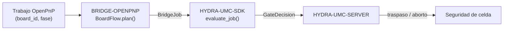

<!-- =============================================================================
HYDRA-UMC-BRIDGE-OPENPNP - Puente de flujo de placas para OpenPnP
Copyright (C) 2026 JuanenRac (Electro Hobby 3D) <electrohobby3d@gmail.com>
GPL-3.0-or-later - see LICENSE
============================================================================= -->

<p align="center">
  
</p>

# 🎯 HYDRA-UMC-BRIDGE-OPENPNP

<p align="center"><a href="README.md">🇺🇸 English</a> | 🇪🇸 <b>Español</b> | <a href="README_fra.md">🇫🇷 Français</a> | <a href="README_ita.md">🇮🇹 Italiano</a> | <a href="README_deu.md">🇩🇪 Deutsch</a> | <a href="README_zho.md">🇨🇳 简体中文</a> | <a href="README_jpn.md">🇯🇵 日本語</a></p>

### 📋 Puente de coordinación trazable de flujo de placas para OpenPnP

<p align="left">
  
  
  
</p>

---

## 1. 🛠️ VISIÓN TÉCNICA GENERAL

**HYDRA-UMC-BRIDGE-OPENPNP** es el puente de alto nivel de flujo de placas entre HYDRA-UMC y OpenPnP. Coordina la preparación de PCB, la carga por robot, la colocación nativa, la descarga por robot y la finalización trazable. No implementa cinemática de colocación, control de alimentadores ni movimiento en bruto: eso permanece enteramente dentro de OpenPnP.

Pertenece a la familia **External Automation Bridges**: un conjunto de repositorios hermanos (CNC, LASER, OPENPNP, PRINTER3D, ROS2) que hablan el mismo contrato de seguridad compartido de `HYDRA-UMC-SDK`, de modo que ningún puente puede inventar su propia definición de "seguro para trabajar".

### Características clave:
* ✅ **Núcleo trazable de flujo de placas, real:** `board_flow.py` — `BoardFlow.plan()` rechaza cualquier trabajo cuyo `board_id` esté vacío o tenga espacios al inicio/final *antes* incluso de evaluar la puerta de seguridad; cada traspaso debe llevar un identificador estable y limpio. *(implementado, probado en `tests/test_board_flow.py`)*
* ✅ **Mapa de traspaso por fase, real:** un diccionario fijo mapea cada `JobPhase` (`PREPARE`, `LOAD`, `PROCESS`, `UNLOAD`, `COMPLETE`, `ABORT`) a una descripción explícita y legible del traspaso — `verify-board-and-fixture`, `robot-loads-board-into-pnp-fixture`, `openpnp-places-declared-job`, etc. *(implementado)*
* ✅ **Puerta de seguridad compartida, real:** cada trabajo válido se evalúa mediante `evaluate_job()` de `bridge_contract` en `HYDRA-UMC-SDK`, la misma puerta que usan todos los puentes hermanos y HYDRA-UMC-SERVER; un traspaso productivo solo avanza cuando la máquina externa reporta `IDLE` y la celda HYDRA-UMC está `READY`. *(implementado)*
* ✅ **Compilación/prueba no mutante:** `build-test.bat`/`.sh` compilan el código y ejecutan la batería de pruebas de trazabilidad de placas y seguridad sin tocar archivos de versión ni el CHANGELOG. *(implementado, ver COMPILACIÓN Y EJECUCIÓN más abajo)*
* ✅ **Inspección de perfil OpenPnP de solo lectura:** `inspect_openpnp_config.py` analiza un `machine.xml` guardado, mientras `openpnp-scripts/HYDRA-UMC/inspect_profile.js` es una plantilla de script de menú de OpenPnP que se invoca manualmente; ambos informan solo de clase y recuentos de componentes, y la plantilla muestra ese resultado en un diálogo informativo sin enviar órdenes a la máquina. *(implementado, probado)*
* ✅ **Simulación de traspaso solo trazable:** `BoardIdentity` vincula identificadores de placa, receta, revisión y lote antes de que `simulate_board_handoff()` aplique la puerta compartida del SDK; emite una huella SHA-256 determinista solo para un plan permitido y no tiene E/S de OpenPnP, serie ni máquina. *(implementado, probado)*
* ✅ **Simulación de ciclo productivo solo trazable:** `simulate_board_cycle()` evalúa la secuencia ordenada `PREPARE → LOAD → PROCESS → UNLOAD → COMPLETE` bajo un estado explícito de célula/máquina; cada paso productivo falla cerrado fuera de `READY/IDLE`, y `ABORT` permanece separado en la ruta de seguridad del SDK. *(implementado, probado)*
* ✅ **Contrato de evidencia determinista:** `docs/HANDOFF_EVIDENCE.md` define el esquema `1.0` que emiten ambos simuladores. Solo contiene fase, decisión, motivo y una huella de identidad permitida; los valores de placa, receta, revisión y lote nunca entran en el registro JSON. *(implementado, probado)*

---

## 2. 🔄 FLUJO DE COORDINACIÓN DE PLACAS



---

## 3. 🧱 ARQUITECTURA Y DECISIONES DE DISEÑO

* **Por qué la validación de `board_id` ocurre antes que cualquier otra cosa en `plan()`.** La primera comprobación de `BoardFlow.plan()` es `not board_id or board_id.strip() != board_id`: un identificador de placa malformado o ambiguo se rechaza de inmediato, con una razón explícita, en lugar de reenviarse aguas abajo donde sería más difícil de trazar.
* **Por qué los traspasos son un diccionario fijo indexado por `JobPhase`, no formateo de cadenas.** `BoardFlow._handoffs` mapea cada una de las seis fases admitidas a una descripción literal e inequívoca. Una fase futura desconocida se rechaza como `unrecognized-phase`; no puede convertirse en un traspaso permitido solo porque la puerta común del SDK esté preparada.
* **Por qué el puente solo planifica un traspaso productivo cuando la máquina externa está `IDLE` y la celda está `READY`.** El traspaso de placas es una operación física de dos partes; si cualquiera de los dos lados no está en un estado conocido y seguro, planificar un traspaso significaría pedirle a un robot que se mueva hacia una máquina impredecible.
* **Por qué `ABORT` sigue siendo solicitable durante un fallo.** `JobPhase.ABORT` se mapea a `request-controlled-stop`, algo que la puerta compartida `evaluate_job()` no bloquea de la misma forma que bloquea las fases productivas — un operador o supervisor siempre debe poder pedir una parada controlada, incluso en mitad de un fallo.
* **Por qué la extensión/API viva de OpenPnP sigue aplazada.** El perfil guardado de máquina ya puede inspeccionarse en solo lectura, pero elegir una interfaz de plugin o superficie viva aún requiere una sesión de pruebas no productiva; así se evita incorporar suposiciones no verificadas de movimiento o alimentadores.
* **Cómo encaja en el resto del ecosistema.** BRIDGE-OPENPNP se sitúa entre un trabajo de OpenPnP y `HYDRA-UMC-SDK` → `HYDRA-UMC-SERVER` → seguridad de celda: coordina el lado robótico de un traspaso de placas, nunca reclama la cinemática de colocación ni el control de alimentadores que pertenecen a OpenPnP.

---

## 📂 ESTRUCTURA DE DIRECTORIOS

```text
HYDRA-UMC-BRIDGE-OPENPNP/
├── src/
│   └── hydra_umc_bridge_openpnp/
│       ├── __init__.py
│       └── board_flow.py        # BoardFlow: validación de board_id + puerta de traspaso por fase
├── tests/
│   └── test_board_flow.py       # Pruebas de trazabilidad de placas y seguridad
├── tools/
│   ├── build_test.py            # Compilador + ejecutor de pruebas no mutante (build-test.bat/.sh)
│   └── bump_version.py          # Sincroniza pyproject.toml, manifiesto y CHANGELOG.md
├── build-test.bat / build-test.sh  # Solo valida, nunca modifica el repositorio
├── build.bat / build.sh            # Valida y, solo si tiene éxito, sube versión + CHANGELOG
├── pyproject.toml               # Metadatos del paquete; depende de HYDRA-UMC-SDK (git)
├── hydra-umc.project.json       # Manifiesto del ecosistema (versión, madurez, familia)
├── CHANGELOG.md
├── CODE_OF_CONDUCT.md / CONTRIBUTING.md / SECURITY.md / SUPPORT.md
├── LICENSE / LICENSE.md
└── README.md / README_*.md      # Este archivo y sus 6 traducciones
```

---

## 4. ⚙️ COMPILACIÓN Y EJECUCIÓN

Requiere Python 3.11+. `tools/build_test.py` espera que `HYDRA-UMC-SDK` esté clonado como directorio hermano (`../HYDRA-UMC-SDK`) o indicado mediante la variable de entorno `HYDRA_UMC_SDK_ROOT`.

```bash
# Windows
build-test.bat      # solo valida — sin cambio de versión/CHANGELOG
build.bat            # valida y, si tiene éxito, sube versión + CHANGELOG

# Linux/macOS
bash build-test.sh
bash build.sh
```

`build-test` compila cada módulo bajo `src/` con `py_compile` y ejecuta la batería completa de `unittest` (`tests/test_board_flow.py`), demostrando el rechazo por trazabilidad de placas y la puerta de seguridad — nunca modifica el repositorio. `build` ejecuta primero esa misma validación y, solo si tiene éxito, llama a `tools/bump_version.py` para sincronizar la versión en `pyproject.toml`, `hydra-umc.project.json` y `CHANGELOG.md`. Todavía no existe un comando `run` real de máquina — eso requiere una integración de OpenPnP validada.

---

## ✅ ESTADO ACTUAL Y PRÓXIMOS PASOS

**Real hoy:** versión `0.0.8`, un núcleo trazable de traspaso de PCB probado en local (`BoardFlow`) apoyado en la puerta de trabajo compartida de `HYDRA-UMC-SDK`, una batería `unittest` determinista de catorce pruebas, un inspector de perfil guardado, una plantilla visible de menú OpenPnP de solo lectura, simulaciones de traspaso/ciclo vinculadas a identidad y un contrato JSON de evidencia no sensible sin E/S de máquina.

**Frontera de integración:** OpenPnP conserva en todo momento la cinemática de colocación, el control de alimentadores y el movimiento en bruto; este puente solo controla y traza el *traspaso* alrededor de ello — carga por robot, finalización de la colocación nativa, descarga por robot.

**Todavía pendiente:** no se afirma ninguna conexión viva con una máquina OpenPnP — la extensión/API concreta se elegirá solo en una sesión aislada no productiva con un operador presente.

---

## 🔗 PROYECTOS RELACIONADOS

Este proyecto forma parte de un ecosistema robótico más amplio del mismo autor (JuanenRac / Electro Hobby 3D), que abarca firmware, software de control, nodos de IA y herramientas de flota. Merece la pena conocerlo, ya que una petición podría en realidad referirse a uno de estos proyectos y no a este repositorio.

### Directamente relacionados

- **[HYDRA-UMC-SDK](https://github.com/JuanenRac/HYDRA-UMC-SDK)** — la puerta compartida de trabajos y seguridad a través de la cual este puente (y todos los demás) evalúa sus trabajos.
- **[HYDRA-UMC-SERVER](https://github.com/JuanenRac/HYDRA-UMC-SERVER)** — la frontera de orquestación autorizada a la que reporta este puente.
- **[HYDRA-UMC-SAFETY-ZONES](https://github.com/JuanenRac/HYDRA-UMC-SAFETY-ZONES)** — futura evidencia de zona de celda.

### Resto del ecosistema

**Plataforma HYDRA-UMC** — la micro-fábrica multi-robot para la que este puente coordina auxiliares
- **[HYDRA-UMC](https://github.com/JuanenRac/HYDRA-UMC)** — la placa base CM5 + STM32H745 que orquesta hasta 8 brazos robóticos.
- **[HYDRA-UMC-SERVER](https://github.com/JuanenRac/HYDRA-UMC-SERVER)** — el backend Express/WebSocket con el que hablan todos los clientes de control y puentes.
- **[HYDRA-UMC-STUDIO](https://github.com/JuanenRac/HYDRA-UMC-STUDIO)** — panel de control web, visualización 3D multi-robot.

**External Automation Bridges** — repositorios hermanos que comparten esta misma puerta de trabajo de `HYDRA-UMC-SDK`
- **[HYDRA-UMC-BRIDGE-CNC](https://github.com/JuanenRac/HYDRA-UMC-BRIDGE-CNC)** — puente de coordinación de celda CNC.
- **[HYDRA-UMC-BRIDGE-LASER](https://github.com/JuanenRac/HYDRA-UMC-BRIDGE-LASER)** — puente de coordinación de celdas láser.
- **[HYDRA-UMC-BRIDGE-PRINTER3D](https://github.com/JuanenRac/HYDRA-UMC-BRIDGE-PRINTER3D)** — puente de coordinación para software abierto de impresión 3D.
- **[HYDRA-UMC-BRIDGE-ROS2](https://github.com/JuanenRac/HYDRA-UMC-BRIDGE-ROS2)** — frontera de coordinación bidireccional con ROS 2.

**Evidencia de seguridad e integración**
- **[HYDRA-UMC-SAFETY-ZONES](https://github.com/JuanenRac/HYDRA-UMC-SAFETY-ZONES)** — evidencia de seguridad de zonas de celda usada en toda la familia de puentes.
- **[HYDRA-UMC-HIL-BRIDGE](https://github.com/JuanenRac/HYDRA-UMC-HIL-BRIDGE)** — evidencia de pruebas hardware-in-the-loop.

## 👤 AUTOR
**JuanenRac** (Electro Hobby 3D)
📧 electrohobby3d@gmail.com

## 📜 LICENCIA
GPL-3.0 - Ver LICENSE para más detalles.

## 🛠️ COMPILACIÓN Y EJECUCIÓN

Usa la comprobación de compilación sin versionado antes de una compilación de publicación:

| Acción | Windows | Linux / macOS |
|---|---|---|
| Comprobación de compilación (sin cambio de versión ni CHANGELOG) | `build-test.bat` | `./build-test.sh` |
| Ejecución / desarrollo (cuando exista) | `run*.bat` o `dev*.bat` | `./run*.sh` o `./dev*.sh` |

`build-test.bat` y `build-test.sh` compilan o validan la pila del proyecto sin incrementar `hydra-umc.project.json` ni modificar `CHANGELOG.md`. Solo pueden generar salida normal del compilador. Los scripts `build*.bat`, `build*.sh`, `run*` y `dev*` existentes conservan su comportamiento propio del proyecto, versionado o en tiempo de ejecución; úsalos cuando se necesite ese comportamiento.
