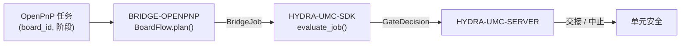

<!-- =============================================================================
HYDRA-UMC-BRIDGE-OPENPNP - OpenPnP 板级流程桥接
Copyright (C) 2026 JuanenRac (Electro Hobby 3D) <electrohobby3d@gmail.com>
GPL-3.0-or-later - see LICENSE
============================================================================= -->

<p align="center">
  
</p>

# 🎯 HYDRA-UMC-BRIDGE-OPENPNP

<p align="center"><a href="README.md">🇺🇸 English</a> | <a href="README_spa.md">🇪🇸 Español</a> | <a href="README_fra.md">🇫🇷 Français</a> | <a href="README_ita.md">🇮🇹 Italiano</a> | <a href="README_deu.md">🇩🇪 Deutsch</a> | 🇨🇳 <b>简体中文</b> | <a href="README_jpn.md">🇯🇵 日本語</a></p>

### 📋 面向 OpenPnP 的可追溯板级流程协调桥接

<p align="left">
  
  
  
</p>

---

## 1. 🛠️ 技术概览

**HYDRA-UMC-BRIDGE-OPENPNP** 是 HYDRA-UMC 与 OpenPnP 之间的高层板级流程桥接。它协调 PCB 准备、机器人上料、原生贴装、机器人下料以及可追溯的完成流程。它不实现贴装运动学、送料器控制或原始运动——这些完全留在 OpenPnP 内部。

它属于 **External Automation Bridges** 家族:一组共享 `HYDRA-UMC-SDK` 相同安全契约的兄弟仓库(CNC、LASER、OPENPNP、PRINTER3D、ROS2),因此任何一个桥接都不能自行发明"可以安全工作"的定义。

### 核心特性:
* ✅ **真实的可追溯板级流程核心:** `board_flow.py` 中的 `BoardFlow.plan()` 会在*甚至还未评估*安全门控之前,就拒绝任何 `board_id` 为空或前后带有空白字符的任务——每次交接都必须携带一个稳定、干净的标识符。*(已实现,并在 `tests/test_board_flow.py` 中测试)*
* ✅ **真实的按阶段交接映射:** 一个固定字典将每个 `JobPhase`(`PREPARE`、`LOAD`、`PROCESS`、`UNLOAD`、`COMPLETE`、`ABORT`)映射为一条明确、可读的交接描述——`verify-board-and-fixture`、`robot-loads-board-into-pnp-fixture`、`openpnp-places-declared-job` 等。*(已实现)*
* ✅ **真实的共享安全门控:** 每个有效任务都会通过 `HYDRA-UMC-SDK` 的 `bridge_contract` 中的 `evaluate_job()` 进行评估,这与所有兄弟桥接以及 HYDRA-UMC-SERVER 使用的是同一个门控;只有当外部机器上报 `IDLE` 且 HYDRA-UMC 单元为 `READY` 时,生产性交接才会继续。*(已实现)*
* ✅ **非变更式构建/测试:** `build-test.bat`/`.sh` 编译源码并运行板级可追溯性与故障安全测试套件,不会触碰版本文件或 CHANGELOG。*(已实现,见下方"构建与运行")*
* ✅ **只读 OpenPnP 配置文件检查:** `inspect_openpnp_config.py` 会解析保存的 `machine.xml`,而 `openpnp-scripts/HYDRA-UMC/inspect_profile.js` 是手动调用的 OpenPnP 菜单脚本模板;两者只报告类别和组件数量,模板会在信息对话框中显示结果,绝不发送机器命令。*(已实现,已测试)*
* ✅ **仅追溯性交接模拟:** `BoardIdentity` 会绑定板、配方、修订版和批次标识,然后由 `simulate_board_handoff()` 应用共享 SDK 门控;仅对获准计划生成确定性的 SHA-256 追溯指纹,不含 OpenPnP、串口或机器 I/O。*(已实现,已测试)*
* ✅ **仅追溯性生产周期模拟:** `simulate_board_cycle()` 在明确的单元/机器状态下评估有序 `PREPARE → LOAD → PROCESS → UNLOAD → COMPLETE` 序列;每个生产步骤在 `READY/IDLE` 之外都会安全拒绝,而 `ABORT` 仍在 SDK 安全路径中独立处理。*(已实现,已测试)*
* ✅ **确定性证据契约:** `docs/HANDOFF_EVIDENCE.md` 定义两个模拟器产生的 `1.0` 模式。它只携带阶段、决定、原因和获准的身份指纹;原始板、配方、修订版和批次值绝不会进入 JSON 记录。*(已实现,已测试)*

---

## 2. 🔄 板级流程协调流程



---

## 3. 🧱 架构与设计决策

* **为什么 `board_id` 校验会在 `plan()` 中最先发生。** `BoardFlow.plan()` 的第一项检查就是 `not board_id or board_id.strip() != board_id`——格式错误或含糊的板 ID 会立即被拒绝并给出明确原因,而不是被转发到下游、变得更难追溯。
* **为什么交接是一个按 `JobPhase` 索引的固定字典,而不是字符串格式化。** `BoardFlow._handoffs` 将六个受支持阶段中的每一个都映射为一条字面且无歧义的描述。未知的未来阶段会被拒绝为 `unrecognized-phase`;它不会仅因为共享 SDK 门控已就绪就变成允许的交接。
* **为什么桥接只有在外部机器 `IDLE` 且单元 `READY` 时才会规划生产性传输。** 板级交接是一个双方参与的物理操作;只要任一方不处于已知的安全状态,规划传输就等于要求机器人移向一台不可预测的机器。
* **为什么在故障期间仍可请求 `ABORT`。** `JobPhase.ABORT` 映射为 `request-controlled-stop`,共享的 `evaluate_job()` 门控不会像阻止生产性阶段那样阻止它——操作员或监督者必须始终能够请求受控停止,即使正处于故障中。
* **为什么实时 OpenPnP 扩展/API 仍被推迟。** 保存的机器配置文件现在可以只读检查,但选择插件接口或实时接口仍需要非生产测试会话;这样可避免写入未经验证的运动或供料器假设。
* **它如何融入整个生态系统。** BRIDGE-OPENPNP 位于一个 OpenPnP 任务与 `HYDRA-UMC-SDK` → `HYDRA-UMC-SERVER` → 单元安全之间:它协调板级交接的机器人一侧,绝不会声称拥有本属于 OpenPnP 自身的贴装运动学或送料器控制能力。

---

## 📂 目录结构

```text
HYDRA-UMC-BRIDGE-OPENPNP/
├── src/
│   └── hydra_umc_bridge_openpnp/
│       ├── __init__.py
│       ├── board_flow.py        # BoardFlow: board_id 校验 + 按阶段交接门控
│       ├── configuration.py     # 在不打开或修改任何机器的情况下检查 OpenPnP 机器 XML
│       ├── evidence.py          # 仅基于本地模拟生成确定性、非敏感的证据
│       ├── handoff.py           # 校验/模拟可追溯的 PCB 交接 - 绝不导入 OpenPnP,也不涉及任何 I/O
│       └── mqtt_transport.py    # 真实 MQTT broker 传输 - 这里根本不存在真实的机器传输
├── tests/
│   ├── test_board_flow.py       # 板级可追溯性与故障安全测试
│   └── test_mqtt_transport.py   # 针对模拟 broker 客户端的 MQTT 证据/状态格式测试
├── tools/
│   ├── build_test.py            # 非变更式编译 + 测试运行器 (build-test.bat/.sh)
│   └── bump_version.py          # 同步 pyproject.toml、清单和 CHANGELOG.md
├── docs/
│   ├── BRIDGE_GUIDE.md          # 范围、兼容平台、脚本、硬件验收门控
│   └── HANDOFF_EVIDENCE.md      # 什么算作真实交接证据,以及此 bridge 拒绝推断的内容
├── images/
│   └── HYDRA_UMC_BANNER.svg     # README 横幅图
├── build-test.bat / build-test.sh  # 仅验证,绝不修改仓库
├── build.bat / build.sh            # 先验证,成功后才更新版本 + CHANGELOG
├── pyproject.toml               # 包元数据;依赖 HYDRA-UMC-SDK (git)
├── hydra-umc.project.json       # 生态系统清单(版本、成熟度、家族)
├── CHANGELOG.md
├── CODE_OF_CONDUCT.md / CONTRIBUTING.md / SECURITY.md / SUPPORT.md
├── LICENSE / LICENSE.md
└── README.md / README_*.md      # 本文件及其 6 种译文
```

---

## 4. ⚙️ 构建与运行

需要 Python 3.11+。`tools/build_test.py` 期望 `HYDRA-UMC-SDK` 作为兄弟目录被检出(`../HYDRA-UMC-SDK`),或通过环境变量 `HYDRA_UMC_SDK_ROOT` 指定。

```bash
# Windows
build-test.bat      # 仅验证 —— 不改变版本/CHANGELOG
build.bat            # 先验证,成功后更新版本 + CHANGELOG

# Linux/macOS
bash build-test.sh
bash build.sh
```

`build-test` 使用 `py_compile` 编译 `src/` 下的每个模块,并运行完整的 `unittest` 套件(`tests/test_board_flow.py`),证明板级可追溯性拒绝逻辑和故障安全门控均按预期工作 —— 它绝不会修改仓库。`build` 会先运行同样的验证,只有成功后才调用 `tools/bump_version.py`,在 `pyproject.toml`、`hydra-umc.project.json` 和 `CHANGELOG.md` 之间同步版本号。目前尚无真正的机器 `run` 命令 —— 这需要经过验证的 OpenPnP 集成。

---

## ✅ 当前状态与后续步骤

**目前真实的部分:** 版本 `0.1.1`,一个已在本地测试过的可追溯 PCB 交接核心(`BoardFlow`),依托 `HYDRA-UMC-SDK` 的共享任务门控,配有确定性的二十八项 `unittest` 测试套件、报告真实 OpenPnP 执行器/信号器/喷嘴头证据以及机头/摄像头/驱动器/供料器数量的保存配置文件检查器、可见的手动只读 OpenPnP 菜单模板、身份绑定交接/周期模拟以及经 CI 验证的无机器 I/O 非敏感 JSON 证据契约。

**集成边界:** OpenPnP 始终保留贴装运动学、送料器控制和原始运动;本桥接只负责门控和追踪其周围的*交接*环节——机器人上料、原生贴装的完成、机器人下料。

**仍待完成:** 目前并未声称与 OpenPnP 机器建立实时连接——具体扩展/API 只会在有操作员在场的隔离非生产会话中选定。

---

## 🔗 相关项目

本项目是同一作者(JuanenRac / Electro Hobby 3D)更大的机器人生态系统的一部分,涵盖固件、控制软件、AI 节点和车队工具。了解这一点很有必要,因为某个请求实际上可能与这些项目之一有关,而不是与本仓库有关。

### 直接相关

- **[HYDRA-UMC-SDK](https://github.com/JuanenRac/HYDRA-UMC-SDK)** —— 共享的任务与安全门控,本桥接(以及所有其他桥接)都通过它评估任务。
- **[HYDRA-UMC-SERVER](https://github.com/JuanenRac/HYDRA-UMC-SERVER)** —— 本桥接汇报的经过授权的编排边界。
- **[HYDRA-UMC-MQTT-BROKER](https://github.com/JuanenRac/HYDRA-UMC-MQTT-BROKER)** —— 为本桥自身的 `hydra/bridges/openpnp/...` 主题(作业门控和完整可追溯的交接仿真——没有 `state` 主题,因为这里没有需要观测的真实机器传输)提供的 `mqtt_transport.py` 真实传输 - 详见该仓库自身的 `docs/BRIDGE_TOPICS.md`。
- **[HYDRA-UMC-SAFETY-ZONES](https://github.com/JuanenRac/HYDRA-UMC-SAFETY-ZONES)** —— 未来的单元区域证据。

### 生态系统的其余部分

**HYDRA-UMC 平台** —— 本桥接为其协调辅助功能的多机器人微工厂
- **[HYDRA-UMC](https://github.com/JuanenRac/HYDRA-UMC)** —— 协调多达 8 条机械臂的 CM5 + STM32H745 主板。
- **[HYDRA-UMC-SERVER](https://github.com/JuanenRac/HYDRA-UMC-SERVER)** —— 每个控制客户端和桥接都会对接的 Express/WebSocket 后端。
- **[HYDRA-UMC-STUDIO](https://github.com/JuanenRac/HYDRA-UMC-STUDIO)** —— 基于网页的控制仪表盘,多机器人 3D 可视化。

**External Automation Bridges** —— 共享同一个 `HYDRA-UMC-SDK` 任务门控的兄弟仓库
- **[HYDRA-UMC-BRIDGE-CNC](https://github.com/JuanenRac/HYDRA-UMC-BRIDGE-CNC)** —— CNC 单元协调桥接。
- **[HYDRA-UMC-BRIDGE-LASER](https://github.com/JuanenRac/HYDRA-UMC-BRIDGE-LASER)** —— 激光单元协调桥接。
- **[HYDRA-UMC-BRIDGE-PRINTER3D](https://github.com/JuanenRac/HYDRA-UMC-BRIDGE-PRINTER3D)** —— 面向开源 3D 打印软件的协调桥接。
- **[HYDRA-UMC-BRIDGE-ROS2](https://github.com/JuanenRac/HYDRA-UMC-BRIDGE-ROS2)** —— 与 ROS 2 之间的双向协调边界。

**安全与集成证据**
- **[HYDRA-UMC-SAFETY-ZONES](https://github.com/JuanenRac/HYDRA-UMC-SAFETY-ZONES)** —— 整个桥接家族共用的单元区域安全证据。
- **[HYDRA-UMC-HIL-BRIDGE](https://github.com/JuanenRac/HYDRA-UMC-HIL-BRIDGE)** —— 硬件在环测试证据。

## 👤 作者
**JuanenRac** (Electro Hobby 3D)
📧 electrohobby3d@gmail.com
📺 [youtube.com/@electrohobby3d](https://youtube.com/@electrohobby3d)

## 📜 许可证
GPL-3.0 - 详见 LICENSE。
